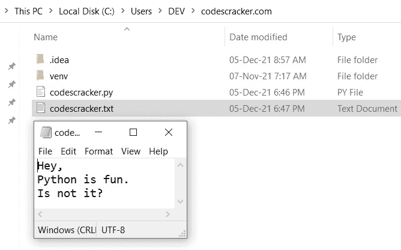
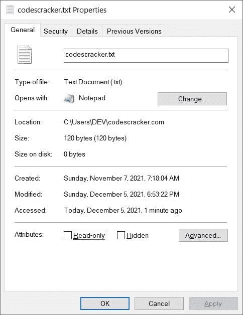
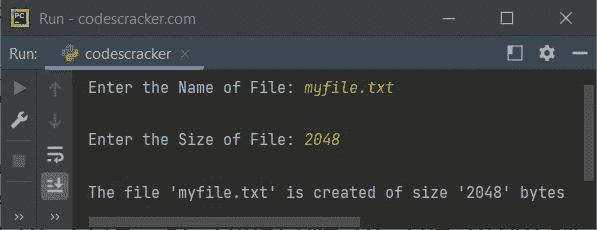

# Python `truncate()`关函数

> 原文：<https://codescracker.com/python/python-truncate-function.htm>

Python 中的 **truncate()** 函数用于截断文件的大小。基本上， **truncate()** 函数用于将文件大小调整到给定的字节数。

例如，我在当前目录中有一个名为 **codescracker.txt** 的文件，用于下面给出的 Python 程序 。下面的快照显示了当前目录以及打开的文件 **codescracker.txt** :



下面的快照显示了上述文件的大小:


现在让我们创建一个程序，将这个文件的大小截断为 **120** 字节:

```
fob = open("codescracker.txt", "a")
fob.truncate(120)
fob.close()
```

执行上述程序后，文件的大小被截断。现在大小是 **120** 字节。下面是显示文件属性的 新快照:



## Python `truncate()`关函数语法

Python 中 **truncate()** 函数的语法是:

```
fileObject.truncate(size)
```

**尺寸**参数是可选的。因此，如果没有指定**尺寸**参数，那么将使用当前位置 。**大小**的默认值为**无**。

## Python `truncate()`关函数示例

下面是 Python 中 **truncate()** 函数的一个例子。该程序允许用户创建一个文件，并在程序运行时 定义文件的大小:

```
print("Enter the Name of File: ", end="")
fileName = input()

fileObject = open(fileName, "a")

print("\nEnter the Size of File: ", end="")
sizeOfFile = int(input())

fileObject.truncate(sizeOfFile)
fileObject.close()

print("\nThe file '{}' is created of size '{}' bytes".format(fileName, sizeOfFile))
```

下面给出的快照显示了上述程序的示例运行，用户输入 **myfile.txt** 作为文件名 和 **2048** 作为总字节大小，以创建一个 2048 字节或 2KB 的文件:



现在，如果您打开当前目录，那么将会有一个与上面示例运行中提供的文件名和大小相同的文件。

[Python 在线测试](/exam/showtest.php?subid=10)

* * *

* * *