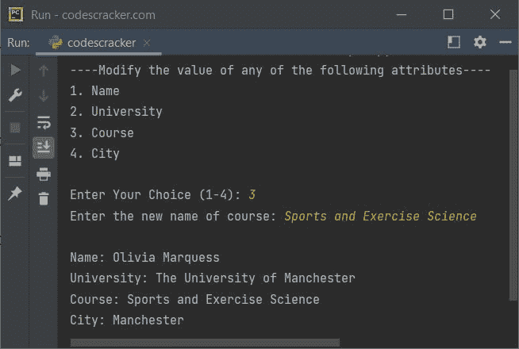

# Python `setattr()`函数

> 原文：<https://codescracker.com/python/python-setattr-function.htm>

Python 中的 **setattr()** 函数在我们需要设置 一个对象的任意指定属性的值时使用。例如:

```
class CodesCracker:
    Name = "Olivia Marquess"
    University = "The University of Manchester"
    Course = "Engineering"
    City = "Manchester"

ob = CodesCracker()
print("The name of student is:", ob.Name)

setattr(CodesCracker, "Name", "Amelia Baron")
print("\nNow the name of student is:", ob.Name)
```

下面给出的快照显示了上述程序产生的示例输出，演示了 Python 中的 **setattr()** 函数:


## Python `setattr()`函数语法

Python 中 **setattr()** 函数的语法是:

```
setattr(object, attribute, newValue)
```

这三个参数都是必需的。函数 **setattr()** 基本上不返回任何值， 或者可以说，它返回 **None** 。该函数只为指定的 对象设置指定属性的新值。

## Python `setattr()`函数示例

下面是 Python 中 **setattr()** 函数的一个例子:

```
class CodesCracker:
    Name = "Olivia Marquess"
    University = "The University of Manchester"
    Course = "Computer Science"
    City = "Manchester"

ob = CodesCracker()
print("----Modify the value of any of the following attributes----")
print("1\. Name")
print("2\. University")
print("3\. Course")
print("4\. City")
print("\nEnter Your Choice (1-4): ", end="")
choice = int(input())
if choice == 1:
    print("Enter the new name of student: ", end="")
    n = input()
    setattr(ob, "Name", n)
elif choice == 2:
    print("Enter the new name of university: ", end="")
    u = input()
    setattr(ob, "University", u)
elif choice == 3:
    print("Enter the new name of course: ", end="")
    co = input()
    setattr(ob, "Course", co)
elif choice == 4:
    print("Enter the new name of city: ", end="")
    ci = input()
    setattr(ob, "City", ci)
else:
    print("\nInvalid Choice!")

if 1 <= choice <= 4:
    print("\nName:", ob.Name)
    print("University:", ob.University)
    print("Course:", ob.Course)
    print("City:", ob.City)
```

以用户输入 **3** 作为选项，以**体育与运动科学**作为新课程名称 的示例运行显示在下面给出的快照中:



### 如果指定的属性不可用怎么办？

如果指定的属性在指定的对象中不可用，则会创建一个具有给定值的新属性。例如:

```
class CodesCracker:
    Name = "Olivia Marquess"
    University = "The University of Manchester"
    Course = "Engineering"
    City = "Manchester"

ob = CodesCracker()

setattr(CodesCracker, "Country", "England")
print("\nThe name of country is:", ob.Country)
```

输出将是:

```
The name of country is: England
```

但是在指定属性不可用的情况下，使用 **setattr()** 创建新属性，只有在指定对象实现 **__dict__** 属性时 才是可能的。 [dir()](/python/python-dir-function.htm) 函数帮助检查任何对象的所有属性。

[Python 在线测试](/exam/showtest.php?subid=10)

* * *

* * *