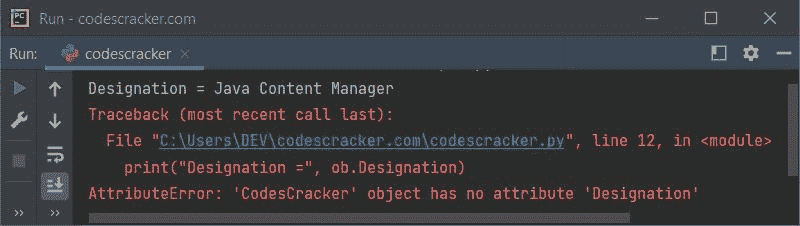
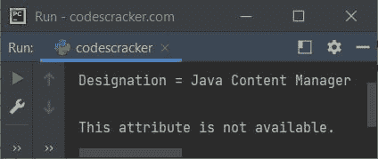

# Python `delattr()`关函数

> 原文：<https://codescracker.com/python/python-delattr-function.htm>

Python 中的 **delattr()** 函数在我们需要从指定对象中删除属性时使用。 例如:

```
class CodesCracker:
    ID = 1249
    Name = "Kenneth"
    Designation = "Java Content Manager"
    Country = "Canada"

delattr(CodesCracker, "Designation")
```

在上述程序中使用以下语句:

```
delattr(CodesCracker, "Designation")
```

名为**名称**的属性将不再可用于 [类](/python/python-classes-objects.htm) **CodesCracker** ，因为它已使用 **delattr()** 函数删除。

## Python `delattr()`关函数语法

Python 中 **delattr()** 函数的语法是:

```
delattr(object, attribute)
```

**对象**指的是指定的**属性**需要删除的对象。 **属性**必须用单引号或双引号括起来。

**注-** 两个参数都是必需的。

## Python `delattr()`关函数示例

这是本文开头给出的程序的修改版本。使用这个程序，在使用 **delattr()** 函数从对象中删除一个特定属性之前，我已经打印了该属性的 值:

```
class CodesCracker:
    ID = 1249
    Name = "Kenneth"
    Designation = "Java Content Manager"
    Country = "Canada"

ob = CodesCracker()
print("Designation =", ob.Designation)

delattr(CodesCracker, "Designation")
```

输出将是:

```
Designation = Java Content Manager
```

但是如果你试图执行相同的语句，那就是:

```
print("Designation =", ob.Designation)
```

删除属性**名称**后。这是错误，你会看到:



引发的异常是 **AttributeError** ，因此，如果您试图使用 **delattr()** 函数删除一个属性，该属性在指定的对象中不存在。那么在这种情况下，这个异常也会被引发。因此，一定要处理这个异常。让我们创建一个程序来处理这个异常，同时 删除并打印类 **CodesCracker** 的任何属性:

```
class CodesCracker:
    ID = 1249
    Name = "Kenneth"
    Designation = "Java Content Manager"
    Country = "Canada"

ob = CodesCracker()

try:
    print("\nDesignation =", ob.Designation)
except AttributeError:
    print("\nThis attribute is not available.")

try:
    delattr(CodesCracker, "Designation")
except AttributeError:
    print("\nThe specified attribute does not exist in the specified object.")

try:
    print("\nDesignation =", ob.Designation)
except AttributeError:
    print("\nThis attribute is not available.")
```

示例输出显示在下面给出的快照中:



[Python 在线测试](/exam/showtest.php?subid=10)

* * *

* * *