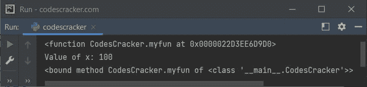

# Python `classsmethod()`关函数

> 原文：<https://codescracker.com/python/python-classmethod-function.htm>

Python 中的 **classmethod()** 函数返回指定函数的类方法。例如:

```
class CodesCracker:
    def welcome(self):
        print("Welcome to CodesCracker")

CodesCracker.welcome = classmethod(CodesCracker.welcome)
CodesCracker.welcome()
```

该程序产生的输出是:

```
Welcome to CodesCracker
```

注意- 一个类方法可以被一个对象或者一个类调用，两者都可以。

**注-** 类方法是方法，绑定到类，而不是类的对象。

**推荐**——使用 [@classmethod decorator](/python/python-classmethod-decorator.htm) 来 定义类方法，而不是使用 **classmethod()** 函数来获取/转换成类方法。

## Python `classmethod()`关函数语法

**classmethod()** 函数的语法是:

```
classsmethod(x)
```

其中 **x** 是一个函数。 **classmethod()** 将函数 **x** 转换成一个类方法。

## Python `classmethod()`关函数示例

以下是 Python 中 classmethod()函数的一个示例:

```
class CodesCracker:
    def myfun(self, x):
        print("Value of x:", x)

print(CodesCracker.myfun)

CodesCracker.myfun = classmethod(CodesCracker.myfun)
CodesCracker.myfun(100)

print(CodesCracker.myfun)
```

下面给出的快照显示了上述 Python 程序产生的示例输出，演示了 **classmethod()** 函数:



从上面的输出可以看出，在使用 **classmethod()** 函数将名为 **myfun()** 的方法转换为类方法之前。声明:

```
print(CodesCracker.myfun)
```

印刷品:

```
<function CodesCracker.myfun at 0x0000022D3EE6D9D0>
```

表示类 **CodesCracker** 的函数 **myfun** 像一个普通函数。但是 使用了下面的语句后:

```
CodesCracker.myfun = classmethod(CodesCracker.myfun)
```

同一个函数被转换成类方法。因此现在声明如下:

```
print(CodesCracker.myfun)
```

印刷品:

```
<bound method CodesCracker.myfun of <class '__main__.CodesCracker'>>
```

表示函数 **myfun** 变成了现在绑定到类 **CodesCracker** 、 的方法，并且 **myfun()** 现在是类方法。

**相关文章** - [Python 类方法 Vs 静态方法](/python/python-class-method-vs-static-method.htm)。

[Python 在线测试](/exam/showtest.php?subid=10)

* * *

* * *