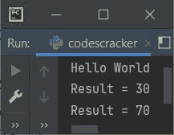

# Python staticmethod()函数

> 原文：<https://codescracker.com/python/python-staticmethod-function.htm>

Python 中的 **staticmethod()** 函数返回指定函数的静态方法，或者将 转换为静态方法。例如:

```
class CodesCracker:
    def myfun(x):
        print("The value of x:", x)

staticmethod(CodesCracker.myfun)
CodesCracker.myfun(500)
```

这个 Python 程序产生的输出是:

```
The value of x: 500
```

使用以下语句后，方法 **myfun()** 被转换为静态方法:

```
staticmethod(CodesCracker.myfun)
```

由于方法 **myfun()** 变成了静态方法，因此 **myfun()** ， 的第一个参数不会被认为是**自身**。 **self** 指的是对象实例。

静态方法不能访问类是什么，而类方法可以。

**推荐**——使用 [@staticmethod decorator](/python/python-staticmethod-decorator.htm) 到 定义静态方法，而不是使用 **staticmethod()** 函数转换成静态方法。

一个静态方法可以被一个对象或者一个类调用，两者都可以。

## Python staticmethod()函数语法

Python 中 **staticmethod()** 的语法是:

```
staticmethod(fun)
```

## Python staticmethod()函数示例

下面是 Python 中 staticmethod()的一个例子。在这个程序中，我在类中创建了三个方法。第一个方法创建为[打印“Hello World”](/python/program/python-program-print-hello-world.htm)， 第二个方法创建为返回其两个参数之和，第三个方法类似于 第二个但没有返回语句:

```
class CodesCracker:
    def funOne():
        print("Hello World")
    def funTwo(a, b):
        return a+b
    def funThree(x, y):
        print("Result =", x+y)

staticmethod(CodesCracker.funOne)
CodesCracker.funOne()

staticmethod(CodesCracker.funTwo)
res = CodesCracker.funTwo(10, 20)
print("Result =", res)

staticmethod(CodesCracker.funThree)
CodesCracker.funThree(30, 40)
```

下面给出的快照显示了上述程序的示例输出:



**相关文章** - [Python 类方法 Vs 静态方法](/python/python-class-method-vs-static-method.htm)。

[Python 在线测试](/exam/showtest.php?subid=10)

* * *

* * *