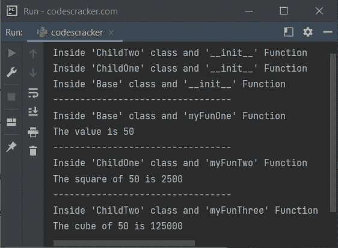

# Python super()函数

> 原文：<https://codescracker.com/python/python-super-function.htm>

Python 中的 **super()** 函数用于允许访问基类 或父类[的方法和属性](/python/python-classes-objects.htm)。例如:

```
class Base:
    def __init__(self, x, y):
        self.valOne = x
        self.valTwo = y

    def sum(self):
        res = self.valOne + self.valTwo
        return res

class Child(Base):
    def __init__(self, a, b):
        super().__init__(a, b)

ob = Child(50, 60)
print(ob.sum())
```

输出是:

```
110
```

## Python super()函数语法

Python 中 **super()** 函数的语法是:

```
super()
```

后面跟着 **__init__()** 带参数要传递的函数。

**注意-****super()**对于访问类中被覆盖的继承方法很有用。 也有助于工作与继承。

## Python super()函数示例

下面是 Python 中 **super()** 函数的一个例子。我已经创建了两个类，分别是**基类**和 **子类**，在**子类**中，我使用了 **super()** 函数，这样我就可以使用**基类**的方法 和属性，当然是使用**子类**的对象。

```
class Base:
    def __init__(self, x):
        print("In 'Base' class and '__init__' Function")
        self.val = x

    def myFunOne(self):
        print("In 'Base' class and 'myFunOne' Function")
        print("The value is:", self.val)

    def myFunTwo(self):
        print("In 'Base' class and 'myFunOne' Function")
        print("The square of", self.val, "is:", self.val*self.val)

class Child(Base):
    def __init__(self, a):
        print("In 'Child' class and '__init__' Function")
        super().__init__(50)
```

现在使用下面的语句:

```
bo = Child(50)
```

我们将获得以下输出:

```
In 'Child' class and '__init__' Function
In 'Base' class and '__init__' Function
```

也就是说，在创建了一个**子类**的对象后，两个 **__init__()** 方法都会自动被调用 。但是首先调用**子类**的 **__init__()** 方法。

现在下面的代码/语句:

```
bo.myFunOne()
```

生产:

```
In 'Base' class and 'myFunOne' Function
The value is: 50
```

类似地，下面的声明:

```
bo.myFunTwo()
```

生产:

```
In 'Base' class and 'myFunOne' Function
The square of 50 is: 2500
```

让我们创建另一个程序，演示 Python 中的 **super()** 函数:

```
class Base:
    def __init__(self, x):
        print("Inside 'Base' class and '__init__' Function")
        self.val = x

    def myFunOne(self):
        print("Inside 'Base' class and 'myFunOne' Function")
        print("The value is", self.val)

class ChildOne(Base):
    def __init__(self, a):
        print("Inside 'ChildOne' class and '__init__' Function")
        self.val = a
        super().__init__(a)

    def myFunTwo(self):
        print("Inside 'ChildOne' class and 'myFunTwo' Function")
        sq = self.val * self.val
        print("The square of", self.val, "is", sq)

class ChildTwo(ChildOne):
    def __init__(self, a):
        print("Inside 'ChildTwo' class and '__init__' Function")
        self.val = a
        super().__init__(a)

    def myFunThree(self):
        print("Inside 'ChildTwo' class and 'myFunThree' Function")
        cu = self.val*self.val*self.val
        print("The cube of", self.val, "is", cu)

ob = ChildTwo(50)
print("---------------------------------")
ob.myFunOne()
print("---------------------------------")
ob.myFunTwo()
print("---------------------------------")
ob.myFunThree()
```

下面给出的快照显示了上述 Python 程序产生的示例输出:



**注意-****super()**函数用于，当然避免显式引用基类。

[Python 在线测试](/exam/showtest.php?subid=10)

* * *

* * *