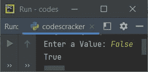
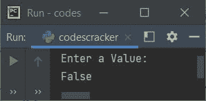

# Python `bool()`关函数

> 原文：<https://codescracker.com/python/python-bool-function.htm>

Python 中的 **bool()** 函数返回指定对象的布尔值(**真**或**假**)。 例如:

```
x = 0
print(bool(x))

x = False
print(bool(x))

x = None
print(bool(x))

x = []
print(bool(x))

x = 10
print(bool(x))

x = [50]
print(bool(x))

x = [False]
print(bool(x))

x = [0]
print(bool(x))

x = "codescracker"
print(bool(x))
```

下面是这个 Python 程序产生的输出，演示了 **bool()** 函数:

```
False
False
False
False
True
True
True
True
True
```

## Python `bool()`关函数语法

Python 中 **bool()** 函数的语法是:

```
bool(obj)
```

其中 **obj** 是列表、数字、字符串等对象。

**注意-** 如果指定的对象为空， **bool()** 函数总是返回 **False** 。

**注-****bool()**函数返回 **False** ，如果指定对象为(或等于) **False** 、 **0** 、或/和 **None** 。

## Python `bool()`关函数示例

下面是 Python 中 **bool()** 函数的一个例子。该程序允许用户输入值:

```
print("Enter a Value: ", end="")
val = input()
print(bool(val))
```

下面给出的快照显示了上述程序的示例运行，用户输入 **False** :



这是因为，当您输入值 **False** 作为输入，然后使用 **input()** 方法，值 被初始化为 **val** 。但是默认情况下， **input()** 方法将值转换成字符串类型。因此 值 **False** 被视为字符串类型值，而不是布尔值 **False** 。同样的事情发生在**0**T23**无**上。但是当你没有输入任何东西就点击/按下`ENTER`时，意味着变量**val**T24】变空，在这种情况下，输出将为 **False** 。以下是运行示例:



[Python 在线测试](/exam/showtest.php?subid=10)

* * *

* * *