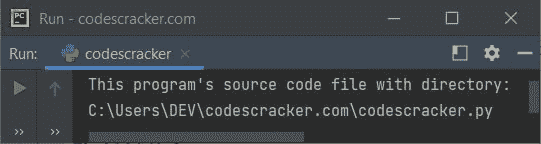

# Python 局部变量()函数

> 原文：<https://codescracker.com/python/python-locals-function.htm>

Python 中的 **locals()** 函数用于以 [字典](/python/python-dictionary.htm)的形式获取当前局部符号表。例如:

```
print(locals())
```

上述程序产生的输出如下所示:

```
{'__name__': '__main__', '__doc__': None, '__package__': None, '__loader__': <_frozen_importlib_external.SourceFileLoader object at 0x000001CFA47A6D00>, '__spec__': None, '__annotations__': {}, '__builtins__': <module 'builtins' (built-in)>, '__file__': 'C:\\Users\\DEV\\codescracker.com\\codescracker.py', '__cached__': None}
```

现在，如果您执行以下代码:

```
v = locals()
print(type(v))
```

那么输出将是:

```
<class 'dict'>
```

意味着函数 **locals()** 返回 **dict** 类型对象

## Python locals()函数语法

Python 中 **locals()** 函数的语法是:

```
locals()
```

## Python locals()函数示例

这里有一个 Python 中的 **locals()** 函数的例子。该程序打印当前 Python 程序的名称 源代码文件以及完整的[目录](/operating-system/directories.htm):

```
x = locals()
print("This program's source code file with directory:")
print(x["__file__"])
```

下面给出的快照显示了该程序产生的示例输出，演示了 **locals()** 函数:



即上述 Python 程序文件保存在目录**C:\ Users \ DEV \ codescracker . com \** 中，文件名为 **codescracker.txt** 。但是在您的情况下，如果您有不同的 文件名和/或目录，输出可能会不同。

[Python 在线测试](/exam/showtest.php?subid=10)

* * *

* * *