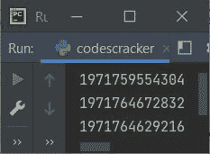

# Python `id()`关函数

> 原文：<https://codescracker.com/python/python-id-function.htm>

Python 中的 **id()** 函数返回任意指定对象的唯一 id。例如:

```
a = [12, 42, 5, 5]
b = (1, 43, 5)
c = "Python Programming"

print(id(a))
print(id(b))
print(id(c))
```

下面给出的快照显示了上述 Python 程序产生的示例输出，演示了 **id()** 函数:



**注意-**Python 中的每个对象在创建时都会被分配一个唯一的 id。因此，每次运行程序时，你都会 为同一个对象获得不同的 id。

## Python `id()`关函数语法

Python 中 **id()** 函数的语法是:

```
id(obj)
```

其中 **obj** 是指一个对象，如[列表](/python/python-lists.htm)、 、[字符串](/python/python-strings.htm)、[元组](/python/python-tuples.htm)、 [类](/python/python-classes-objects.htm)等。

## Python `id()`关函数示例

下面是 Python 中 **id()** 函数的一个例子。

```
num = 100
a = 100

print(id(100))
print(id(num))
print(id(a))
```

所有三个 [print()](/python/python-print-statement.htm) 语句打印出相同的输出，看起来像:

```
2245638378960
2245638378960
2245638378960
```

这是因为，特定的 id 在程序的生命周期中保持不变。

[Python 在线测试](/exam/showtest.php?subid=10)

* * *

* * *