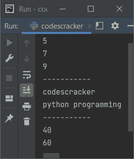
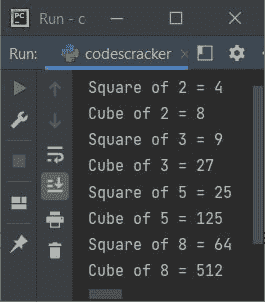

# Python `map()`函数

> 原文：<https://codescracker.com/python/python-map-function.htm>

当我们需要为 iterable 中的每一项执行[函数](/python/python-functions.htm) 时，就会用到 Python 中的 **map()** 函数，其中 item 作为函数的参数传递。例如:

```
def cubes(n):
    return n*n*n

mylist = [2, 3, 4, 5]

res = map(cubes, mylist)
for x in res:
    print(x)
```

输出将是:

```
8
27
64
125
```

## Python `map()`函数语法

Python 中 **map()** 函数的语法是:

```
map(fun, iterables)
```

其中 **fun** 是指指定 iterable 的每一项需要执行的函数。而 **iterables** 指的是一个序列、一个集合或项目，或者一个迭代器对象。

**注-** 可以使用任意数量的可重复项。

**需要注意的点** -该函数的每个可迭代项都有一个参数。

## Python `map()`函数示例

下面是 Python 中的 **map()** 函数的一个例子:

```
def add(x, y):
    return x + y

a = [1, 2, 3]
b = [4, 5, 6]
for x in map(add, a, b):
    print(x)

print("-----------")

a = ("codes", "python ")
b = ("cracker", "programming")
for x in map(add, a, b):
    print(x)

print("-----------")

for x in map(add, (10, 20), (30, 40, 80)):
    print(x)
```

下面给出的快照显示了上述程序产生的示例输出，演示了 **map()** 函数:



让我们创建另一个程序，使用 **map()** 函数在名为 **mylist** 的列表中查找所有可用数字 的正方形和立方体:

```
def square(x):
    return x*x
def cube(x):
    return x*x*x

mylist = [2, 3, 5, 8]
resSq = map(square, mylist)
resCu = map(cube, mylist)

print(list(resSq))
print(list(resCu))
```

输出将是:

```
[4, 9, 25, 64]
[8, 27, 125, 512]
```

让我们修改上面的程序来创建一个输出，它提供的用户体验并不比前面的好:

```
def square(x):
    return x*x
def cube(x):
    return x*x*x

mylist = [2, 3, 5, 8]
resSq = list(map(square, mylist))
resCu = list(map(cube, mylist))

for i in range(len(mylist)):
    print("Square of", mylist[i], "=", resSq[i])
    print("Cube of", mylist[i], "=", resCu[i])
```

现在，输出如下图所示:



[Python 在线测试](/exam/showtest.php?subid=10)

* * *

* * *