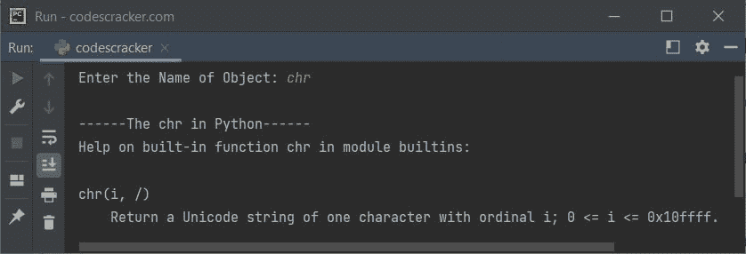

# Python `help()`关函数

> 原文：<https://codescracker.com/python/python-help-function.htm>

Python 中的 **help()** 函数用于当我们需要执行内置的帮助系统来获得关于任何主题如方法、对象等的 描述时。例如:

```
help(input)
```

下面给出的快照显示了上述 Python 代码产生的输出，演示了 **help()** 函数:


输出显示关于**输入**([输入()](/python/python-input-function.htm)函数)的描述。

## Python `help()`关函数语法

Python 中 **help()** 函数的语法是:

```
help(obj)
```

其中 **obj** 指的是一个对象。

## Python `help()`关函数示例

下面是 Python 中 **help()** 函数的一个例子。该程序允许用户输入主题名称 来打印该主题的帮助:

```
print("Enter the Name of Object: ", end="")
obj = input()

print("\n------The", obj, "in Python------")
help(obj)
```

下面给出的快照显示了上述程序的示例运行，用户输入 **chr** :



在上面的示例运行中，用户输入 **chr** 作为输入，由于 [chr()](/python/python-chr-function.htm) 是一个函数，因此通过 **help()** 函数，该函数的简要描述显示在输出 上。

上述程序也可以通过继续接收对象输入来打印该对象的帮助，直到用户输入**退出**结束程序的方式来创建:

```
while True:
    print("\nEnter the Name of Object: ", end="")
    obj = input()

    if obj == "quit":
        break
    help(obj)
```

带有一些对象输入的示例运行显示在下面给出的快照中:


## 在 Python 中运行时获得关于任何对象的帮助

要在 Python 中获得关于程序运行时任何对象的帮助，只需使用以下代码:

```
help()
```

下面给出的快照显示了该 Python 代码产生的初始输出:


现在输入任何对象并按下`ENTER`键来获得关于指定对象的帮助。要结束 程序，键入**退出**并按下`ENTER`键。

您可以获得任何模块、关键字或任何您想获得帮助的内容的详细信息，只需键入并点击`ENTER`键即可查看 Python 中特定主题的详细信息。

[Python 在线测试](/exam/showtest.php?subid=10)

* * *

* * *