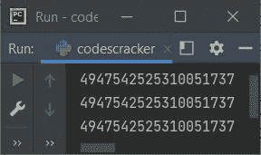

# Python `hash()`函数

> 原文：<https://codescracker.com/python/python-hash-function.htm>

Python 中的 **hash()** 函数返回指定对象的哈希值。例如:

```
a = 120
b = "codescracker"
c = "python programming"
d = True
e = False

print(hash(a))
print(hash(b))
print(hash(c))
print(hash(d))
print(hash(e))
```

输出将是:

```
120
1095362836548201503
7646277759735715480
1
0
```

**注-**Python 中的哈希，基本上就是将任意键或字符串转换成另一种 形式(值)的过程。

大多数情况下，哈希用于通过更短且固定长度的值来表示值，这样更容易找到。

从上面的程序及其示例输出中可以看出，string 类型的对象产生固定长度的哈希值。类似的事情发生在布尔型对象的 **d** 和 **e** 身上。

**注意-** 由于 hash 值基本上是一个固定大小的整数，因此对于 **int** 类型的对象， **hash()** 也返回与 hash 值相同的值。

## Python `hash()`函数语法

Python 中 **hash()** 函数的语法是:

```
hash(obj)
```

其中 **obj** 是指要计算其哈希值的对象。另外，**对象**必须是一个 不可变对象。

## Python `hash()`函数示例

哈希值用于标识特定的值，而不考虑对象的类型。例如:

```
class CodesCracker:
    Topic = "Python Programming"

a = CodesCracker.Topic
b = "Python Programming"

print(hash(a))
print(hash(b))
print(hash("Python Programming"))
```

上述程序产生的输出示例显示在下面给出的快照中:



## 散列在 Python 中的重要用途

当处理一些大的值集合时，Hash 提供了快速的值查找。 [Set](/python/python-set.htm) 和 [Dictionary](/python/python-dictionary.htm) 就是两个例子。因为在 [列表](/python/python-lists.htm)的情况下，如果我们需要检查列表中的值是否可用，使用:

```
if x in mylist:
```

整个列表被逐一扫描，以检查特定的项目、元素或值是否在列表中。当然，当处理具有大量项目的列表时，这可能比通常花费更长的时间。但是在集合的情况下，Python 会跟踪每个散列。因此，如果我们需要检查某个项目是否可用，请使用:

```
if x in myset:
```

Python 将获得 **x** 的 hash 值，在内部结构中查找，只比较与 **x** 具有相同 hash 的 **x** 和 **myset** 。这将比以前的方法快得多。

**注-** 字典也是如此。也就是说，在字典的情况下，同样的事情发生在 用字典的键非常快速地查找特定的键。

这意味着， **list** 属于不可散列对象的范畴，不像 **set** 和 **dict** 。

不可散列对象是可变的或可改变的对象。也就是说，如果一个对象的项目可以更改，这意味着该对象属于不可哈希对象的类别。

而可散列对象是不可变的对象，如**集合**、**字典**的键。

[Python 在线测试](/exam/showtest.php?subid=10)

* * *

* * *