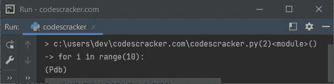
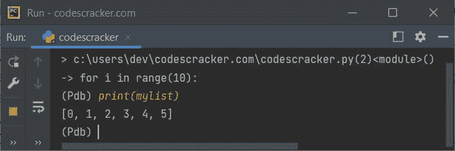
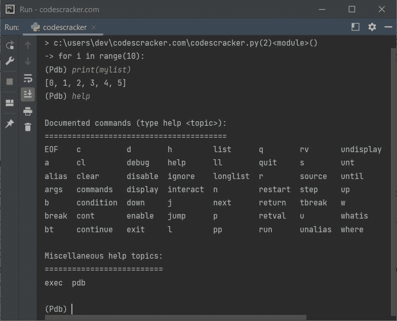
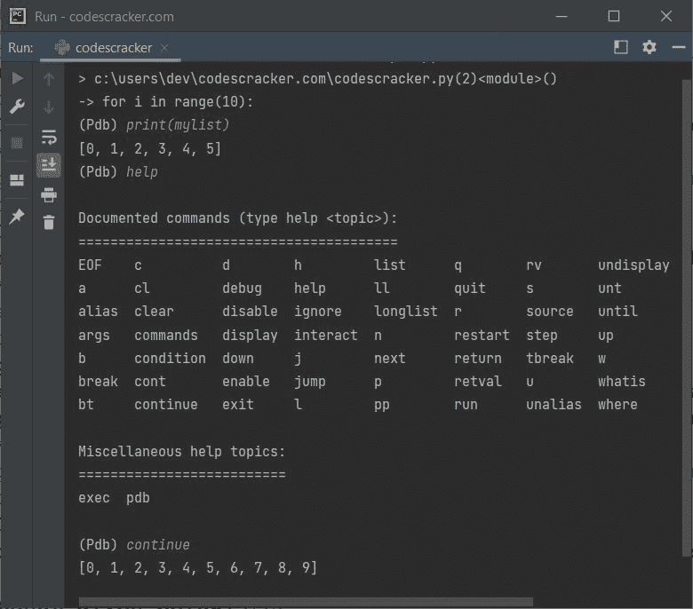
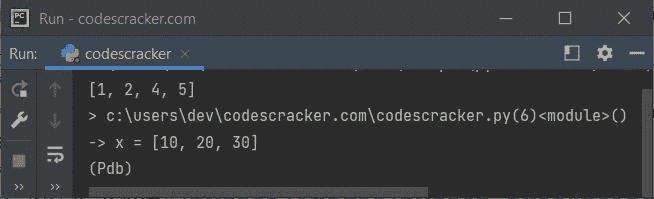
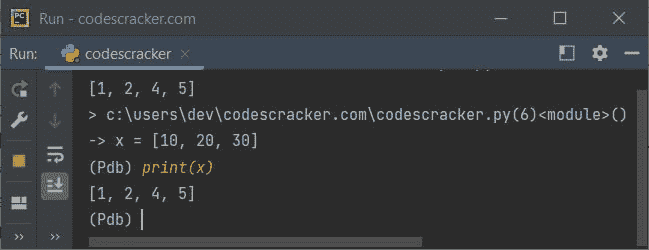
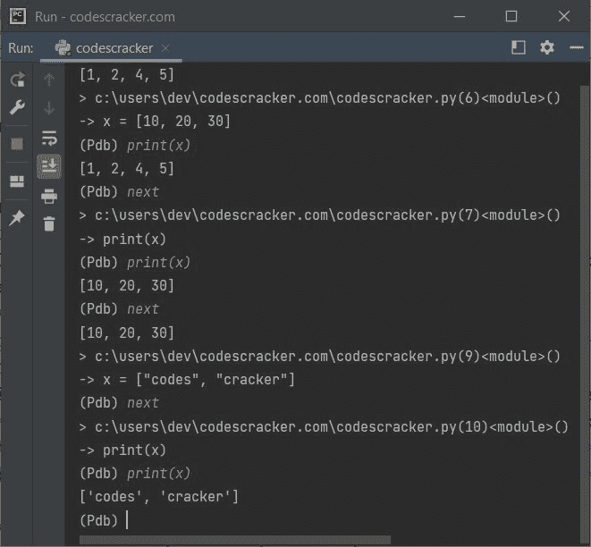
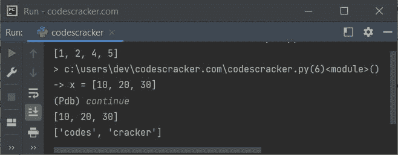

# Python 断点()函数

> 原文：<https://codescracker.com/python/python-breakpoint-function.htm>

Python 中的**断点()**函数放入调用点的调试器中。也就是说，在你的 Python 程序中调用函数 **断点()**后，解释器将控制权交给调试器。例如:

```
mylist = list()
for i in range(10):
    a.append(i)
    if i == 5:
        breakpoint()
print(mylist)
```

下面给出的快照显示了这个 Python 程序产生的初始输出:



也就是说，当 **i** 的值变得等于 **5** 时，则 **if** 的条件评估为 **True** ， 因此程序流进入 **if** 块并且语句:

```
breakpoint()
```

会被处决。所以解释器把控制权交给了调试器。这意味着不再执行已处理的代码。现在使用调试器，我们可以执行和调试代码。例如，让我键入**print(my list)** 来打印之前定义的列表，如下面给出的快照所示:



即在执行**断点()**之前，元素 0，1，2，3，4，5 被追加到名为 **mylist** 的列表中。因此 **print(mylist)** 打印列表。现在，让我们键入 **help** 并按下 `ENTER`键，让所有命令在使用这个 Python 调试器时工作，如下面给出的 快照所示:



**重要** -您可以使用**继续**关键字继续执行代码，获取/打印 最终输出，并关闭调试，如下图所示:



## Python 断点()函数语法

**断点()**函数的语法是:

```
breakpoint(*args, **kws)
```

**breakpoint()** 函数调用 **sys.breakpointhook()** ，通过 **args** 和 **kws** 直通 。

**默认-****sys . breakpointhook()**调用 **pdb.set_trace()** 时不需要任何参数。

**注-** 函数**断点()**提供了一种便捷的方法，使用该函数无需显式导入 **pdb**，即可进入调试器。即直接使用**断点()**，不导入任何东西，将 输入调试器。

## Python 断点()函数示例

下面是 Python 中**断点()**函数的一个例子:

```
x = [1, 2, 4, 5]
print(x)

breakpoint()

x = [10, 20, 30]
print(x)

x = ["codes", "cracker"]
print(x)
```

这个 Python 程序产生的输出展示了**断点()**函数，如下面给出的快照 所示:



使用**断点()**后，最后两条语句没有被解释器解释。因为在 使用**断点()**之后，解释器把控制权交给了调试器。但是不用担心，我们也可以在调试模式下执行 代码。例如， **next** 命令用于执行 **断点()**函数后的下一条语句。在使用**下一个**命令之前，让我使用 **print(x)** 来看看 会输出什么:



看到了，列表 **x** 仍然指的是具有元素 **1，2，4，5** 的列表，意味着语句:

```
x = [10, 20, 30]
```

未执行。因此，让我使用 **next** 命令执行下一条语句，并使用 **print(x)** 打印带有新分配列表项的列表 **x** ，如下图所示:



您可以使用 **continue** 命令继续执行代码，在**断点()**之后执行 剩余的所有代码并停止程序的执行，如下图所示:



你可以用自己的代码创建的调试窗口做很多事情。

[Python 在线测试](/exam/showtest.php?subid=10)

* * *

* * *