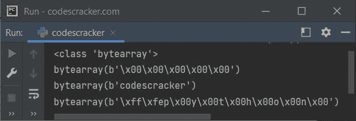
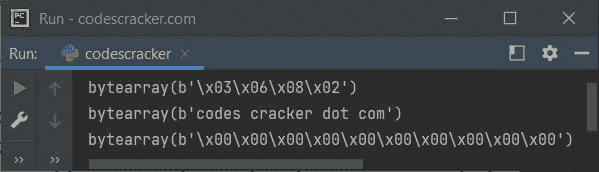

# Python `bytearray()`关函数

> 原文：<https://codescracker.com/python/python-bytearray-function.htm>

Python 中的 **bytearray()** 函数返回一个 [bytearray](/python/python-bytearray.htm) 对象或者 将任何对象转换为 bytearray 对象。例如:

```
x = bytearray()
print(type(x))

print(bytearray(5))

a = "codescracker"
x = bytearray(a, "utf-8")
print(x)

b = "python"
b = bytearray(b, "utf-16")
print(b)
```

下面给出的快照显示了上述 Python 程序产生的示例输出，演示了 **bytearray()** 函数:



**注意-** 与 [bytes()](/python/python-bytes.htm) 不同， **bytearray()** 返回一个可以被 修改的对象。

## Python `bytearray()`关函数语法

*bytearray()* 函数的语法是:

```
bytearray(x, encoding, error)
```

其中 **x** 指源。如果源是整数类型，那么将创建一个具有指定的 大小和给定的 **x** 整数值的空 bytearray 对象。当 **x** 为 [字符串](/python/python-strings.htm)类型时，需要**编码**。当编码失败或不匹配时，使用**错误**。 这三个参数都是可选的。

**注意-** 我们可以使用字符串、整数、可迭代或对象类型作为 **x** 的值。

## Python `bytearray()`关函数示例

下面是 Python 中 **bytearray()** 函数的一个简单例子:

```
mylist = [3, 6, 8, 2]
ba = bytearray(mylist)
print(ba)

mystr = "codes cracker dot com"
ba = bytearray(mystr, "utf-8")
print(ba)

mysize = 10
ba = bytearray(mysize)
print(ba)
```

该程序的示例输出显示在下面给出的快照中:



[Python 在线测试](/exam/showtest.php?subid=10)

* * *

* * *