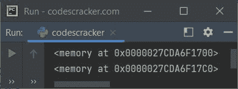
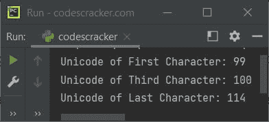
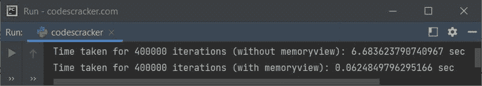

# Python `memoryview()`函数

> 原文：<https://codescracker.com/python/python-memoryview-function.htm>

Python 中的 **memoryview()** 函数从指定对象( [byte](/python/python-bytes.htm) 或 [bytearray](/python/python-bytearray.htm) )返回 [memoryview](/python/python-memoryview.htm) 对象 。 例如:

```
x = memoryview(bytes("Python", "utf-8"))
print(x)

x = memoryview(bytearray("Python", "utf-8"))
print(x)
```

下面给出的快照显示了上述 Python 程序产生的示例输出，演示了 *memoryview()* 函数:



**注意-** 要了解 memoryview 对象，请参考其单独的教程。

## Python `memoryview()`函数语法

Python 中 **memoryview()** 函数的语法是:

```
memoryview(obj)
```

其中 **obj** 是**字节**类型或**字节数组**类型的对象。

## Python `memoryview()`函数示例

下面是 Python 中 *memoryview()* 函数的一个简单例子。该程序将一个*字节*类型 初始化为一个[变量](/python/python-variables.htm) **x** ，然后该变量被转换为 *内存视图*，使用 index 打印特定字符的 Unicode:

```
x = bytes("codescracker", "utf-8")
x = memoryview(x)
print("Unicode of First Character:", x[0])
print("Unicode of Third Character:", x[2])
print("Unicode of Last Character:", x[len(x)-1])
```

下面是它的示例输出:



下面是一个实际的例子，展示了为什么 *memoryview* 对于优化 Python 中的程序是有用的:

```
import time

n = 400000
data = b'a' * n
start = time.time()
while data:
    data = data[1:]
tm = time.time() - start
print("Time taken for", n, "iterations (without memoryview):", tm, "sec")

n = 400000
data = b'a' * n
data = memoryview(data)
start = time.time()
while data:
    data = data[1:]
tm = time.time() - start
print("Time taken for", n, "iterations (with memoryview):", tm, "sec")
```

该程序的示例输出显示在下面给出的快照中:



[Python 在线测试](/exam/showtest.php?subid=10)

* * *

* * *