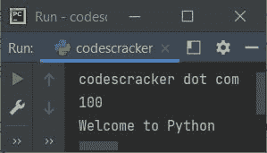

# Python eval()函数

> 原文：<https://codescracker.com/python/python-eval-function.htm>

Python 中的 **eval()** 函数用于对指定的表达式求值。例如:

```
x = 'print("codescracker dot com")'
eval(x)

x = "print(100)"
eval(x)

x = "print(\"Welcome to Python\")"
eval(x)
```

下面给出的快照显示了这个 Python 程序产生的样本输出，演示了 **eval()** 函数:



**注-** 与 [exec()](/python/python-exec-function.htm) 不同， <u>exec</u> utes 动态 生成代码。 **eval()** 函数 <u>eval</u> 评估单个动态生成的表达式。

**注-** 与 **exec()** 不同， **eval()** 只取单个表达式求值。

## Python eval()函数语法

Python 中 **eval()** 函数的语法是:

```
eval(expression, globals, locals)
```

其中:

*   **表达式** -指将要计算的表达式
*   **globals** -指包含全局参数的[字典](/python/python-dictionary.htm)
*   **局部变量** -指包含局部参数的字典

**注意-** 只有第一个参数，即**表达式**参数是必需的。而 另外两个参数是可选的

**注-****表达式**参数为[字符串](/python/python-strings.htm)类型。

## Python eval()函数示例

下面是 Python 中 **eval()** 函数的一个例子。这个程序接收一个关于 x 的函数，然后 接收 x 的值，用给定的 x 值计算表达式:

```
print("Enter the Function (in terms of x): ", end="")
expression = input()
print("Enter the Value of x: ", end="")
x = int(input())

res = eval(expression)
print("\nResult =", res)
```

以用户输入 **x*x*x+x-x** 为函数，以 **2** 为值的示例运行如下面给出的快照 所示:


Python 中的 **eval()** 函数，也可以用来对函数求值。程序如下:

```
def msg():
    print("\nHey!\nWhat's Up?")

def table(num):
    print("\n-------Table of", num, "is---------")
    for i in range(1, 11):
        print(num, "*", i, "=", num*i)

print("Enter the Function: ", end="")
fun = input()
eval(fun)
```

用户输入**表(5)** 的示例运行显示在下面给出的快照中:


下面是另一个使用用户输入 **msg()** 作为函数进行评估的示例:


**重要的**——当你为 **eval()** 方法使用用户输入时，一定要验证用户输入，因为这可能会给你的应用和相关的事情带来一些严重的问题。因为攻击者可能会给 一些有害的命令作为函数的输入。

[Python 在线测试](/exam/showtest.php?subid=10)

* * *

* * *