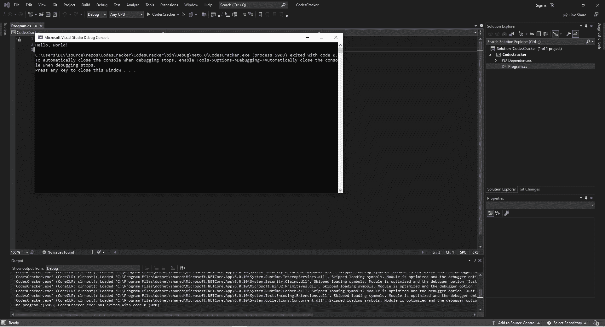

# C#初学者教程

> 原文：<https://codescracker.com/c-sharp/index.htm>

你好，你过得怎么样？
希望一切都好。😀

我叫尼克，我是你们的 C#讲师。这篇 C#教程是为那些想在 C#领域开始职业生涯或者想学习更多 C#知识的人准备的。

这篇 C#教程是为所有对 C#一无所知的初学者而编写的。

整个 C#教程分为这篇和其他一些文章。这篇文章包含了初学者需要知道的几乎所有细节，从在输出控制台上打印数据到从用户那里接收数据。但是在我们开始教程之前，让我们列出这篇文章中涉及的所有主题，这样你可以更容易地导航到任何特定的主题。

*   [c#基础](#a)
*   [c#初学者的热门问题？](#b)
*   [c#入门](#c)
*   [评论](#d)
*   [变量](#e)
*   [数据类型](#f)
*   [接收来自用户的输入](#g)

## C#基础

C#是一种通用的高级计算机编程语言，支持多种范例，包括命令式、结构化、函数式、面向对象、事件和任务驱动等等。

C#受到了以前的编程语言的影响，如 C++、Java、Pascal、ML 和许多其他语言。最近，它影响了 Kotlin、Swift、TypeScript 和许多其他语言。它还可能对将来必须开发的其他语言产生影响。

老实说，C#是开发移动、桌面和 web 应用程序的强大语言。

**请注意:** C#代码看起来与 Java 代码非常相似。这样一来，Java 程序员学习 C#就会简单很多。同样， 如果你对 Java 一窍不通，学了 C#就能很快学会。

## C#初学者的热门问题？

#### C#编程语言是谁设计的？

微软软件工程师安德斯·赫吉斯伯格。

#### C#编程语言是谁开发的？

微软项目经理 Mads Torgersen 说。

#### C#最早是什么时候推出的？

在 2000 年。

#### C#的文件扩展名是什么？

。cs 和. csx
比如: **codescracker.cs** 或者 **codescracker.csx**

## C#入门

现在你已经有足够的知识开始用 C#编码了。我认为与其学习一门语言的所有知识，不如关注它的编码技巧。所以让我们开始吧。

为了编写用于教学目的的所有 C#代码，我将使用“Microsoft Visual Studio”作为我的 IDE。这是 Microsoft Visual Studio 窗口的内部视图。我会在里面写我所有的 C#程序。



现在让我来写第一个 C#程序。代码如下:

```
using System;

namespace MyFirstProgram
{
   class MyClass
   {
      static void Main(string[] args)
      {
         Console.WriteLine("Hello, World!");
      }
   }
}
```

下面的屏幕截图显示了在按下 F5 按钮执行编写的 C#程序后出现的“Microsoft Visual Studio 调试控制台”，它显示了 C#程序产生的输出。


我使用了一个红色箭头来吸引您对输出的注意，它是“Hello，World！”

现在，让我解释一下编写的 C#程序实际上是如何工作的。

**名称空间**是类或其他名称空间的容器。另一方面，**类**是方法的容器。因为所有的 C#代码都必须包含在一个定义的类中，我们可以把这个类称为数据容器。上面 C#程序 中的第一行代码是:

```
using System;
```

这里的关键字是**使用**，命名空间是**系统**。这行代码表明我将在 程序中使用**系统**名称空间。

现在让我们看看 C#代码的第二行:

```
namespace MyFirstProgram
```

使用这段代码，我将创建我的 **MyFirstProgram** 名称空间，在这里我将为当前的 C#程序编写所有的 C#代码。然后我添加了 花括号或 **{}** ，用于开始和/或结束代码块。结果，在 **MyFirstProgram** 之后，我开始编写一个新的 代码块。现在是第三或第四行代码(取决于我们是否包括花括号):

```
class MyClass
```

我用这段代码创建了一个名为 **MyClass** 的类。我使用了一个开放的花括号来开始编写/创建另一个代码块。现在是第四行或第六行代码(取决于我们是否包含第二个花括号):

```
static void Main(string[] args)
```

这一行代码将包含在所有 C#程序中。因为每个 C#程序都需要一个 **Main()** 方法。Main()方法是开始执行 C#程序的方法 。

我在 **Main()** 方法之前添加了关键字 **static** 和 **void** 。当一个方法被声明为静态时，意味着没有对象 可以调用它。void 是返回类型，这意味着不返回值。

在 Main()方法中可以找到另一个代码片段: **String[] args** ，它表示传递给 方法 Main()的字符串序列的数组。这发生在程序运行时。当我们在程序执行过程中向 Main()函数传递参数时，这将非常重要。

现在，忽略花括号，最后一行代码是:

```
Console.WriteLine("Hello, World!");
```

其中**控制台**是**系统**命名空间类， **WriteLine()** 是将写入其中的字符串写入 输出的方法。你也可以从前面的 C#程序中删除第一行代码，编写**系统。**在**控制台之前。WriteLine()** 如下， 得到相同的输出。

```
System.Console.WriteLine("Hello, World!");
```

但是，我也可以使用 Microsoft Visual Studio IDE 直接编写 **WriteLine()** 方法来产生相同的输出。代码如下 :

```
Console.WriteLine("Hello, World!");
```

### C#是区分大小写的语言

C#是一种区分大小写的语言。因此**编码员**、**编码员**和**编码员**都是 C#中的三个不同变量。

### C# Write()与 WriteLine()

要执行类似的任务，可以使用 **Write()** 方法来代替 **WriteLine()** 。WriteLine()在输出控制台 窗口追加一个新行，而 Write()没有。例如:

```
Console.WriteLine("codescracker.com");
Console.WriteLine("codescracker.com");
Console.WriteLine("codescracker.com");
```

生产:

```
codescracker.com
codescracker.com
codescracker.com
```

鉴于:

```
Console.Write("codescracker.com");
Console.Write("codescracker.com");
Console.Write("codescracker.com");
```

生产:

```
codescracker.comcodescracker.comcodescracker.com
```

## C#中的注释

在 C#中，注释用于解释或暂停代码块或代码行的执行。在 C#程序中，注释永远不会作为代码执行。调试代码时，程序员可能会使用注释。

一个注释只有一行，以 **//** 开头。另一方面，评论跨越多行，以 **/*** 开始，以 ***/** 结束。 例如，

```
// Following code will print 'Hello' on output
Console.WriteLine("Hello");

int x = 10;
int y = 20;
int sum = x + y;

/* The line of code given below
 * will print the summation of 
 * 'x' and 'y' on the
 * output console */
Console.WriteLine(sum);

// Console.WriteLine("codescracker.com");

// The previous line of code, will not be executed
```

这个演示注释的 C#程序产生的输出应该完全是

```
Hello
30
```

## C#中的变量

在一个[之前的 C#程序](#a)中，我用了三个变量: **x** 、 **y** 、 **sum** 。C#中的变量是值或 数据容器。也就是说，无论赋予变量什么值，该变量都代表该赋值。因此，无论我们在程序中写什么或者 放什么变量，它都代表赋给它的值或者它保存的当前值。例如:

```
int num = 10;
string website = "codescracker.com";
string temp = website;

Console.WriteLine(num);
Console.WriteLine(website);
Console.WriteLine(temp);
```

上面为演示 C#变量而创建的 C#示例产生的输出应该完全是:

```
10
codescracker.com
codescracker.com
```

在前面的例子中， **num** 、**网站**和 **temp** 是变量的名称。其中 **int** 和 **string** 是其数据 类型。我们将在这一节之后讨论 C#中的数据类型，但是在讨论数据类型之前，让我们先了解一下在 C#中可以使用 来命名变量的规则。

在 C#中命名变量时，我们需要记住的非常简单的规则是:
变量可以是字母、数字和下划线字符的组合，但必须以字母开头。比如: *mynum* 、 T3】my _ num、 *myNum* 、 *mYNUM* 、 *my23num* 、 *mynum23_* 、 *m23my4m3* 。由于 C#是区分大小写的语言，因此 变量 *mynum* 不等于 *myNum* 。

**请记住****const**关键字可用于在整个程序中保持变量值不变。也就是说，用 const 关键字声明的 变量不能被改变，使其成为只读变量。例如:

```
const double pi = 3.14159265;
double rad = 18.34;
double area;
area = pi * rad * rad;

Console.WriteLine("Area of Circle = {0}", area);
```

这个 C#示例产生的输出应该是

```
Area of Circle = 1056.69228074634
```

在上面的 C#例子中， **{0}** 基本上代表了**区域**的值。它用于在输出控制台上打印格式化字符串。

## C#中的数据类型

C#中的数据类型对 C#变量同样重要，因为在声明一个变量时，我们需要定义它的数据类型来定义该变量可以保存什么类型的值。

例如，如果一个变量(比如 myVar)用于保存小值，那么就没有必要将该变量定义为 long 类型，其大小为 8 个字节。下表显示了用于定义变量类型的关键字及其大小和简要描述:

| 关键字 | 大小 | 简要信息 |
| 弯曲件 | 1 位 | 用于定义值为真或假的布尔类型变量 |
| 茶 | 2 字节 | 用于创建可以包含字符的变量 |
| 线 | 每个字符 2 个字节 | 用于定义具有多个字符的变量 |
| （同 Internationalorganizations）国际组织 | 4 字节 | 范围从-2，147，483，648 到 2，147，483，647，用于定义可以保存整型值的变量。 |
| 漂浮物 | 4 字节 | 用于定义可以存储最多七位十进制数字的浮点值的变量 |
| 长的 | 8 字节 | 整型值范围从-9，223，372，036，854，775，808 到 9，223，372，036，854，775，807 的变量。 |
| 两倍 | 8 字节 | 用于定义能够存储 15 位十进制浮点值的变量 |

**请注意:** 1 字节等于 8 位。

**请注意:**在定义 **float** 和 **double** 类型的变量时，我们需要以 **F** 和 **D** 结束其值，这样:

```
float myNumOne = 12.34F;
double myNumTwo = 43.546D;
```

现在让我创建一个例子，演示在同一个程序中使用不同数据类型的变量。

```
bool myBool = true;
char myChar = 'x';
string myStr = "C# programming is Fun!";
int myNum = 10;
float myPerc = 85.67F;
long myContact = 1234567890;
double myArea = 32.43530D;

Console.WriteLine(myBool);
Console.WriteLine(myChar);
Console.WriteLine(myStr);
Console.WriteLine(myNum);
Console.WriteLine(myPerc);
Console.WriteLine(myContact);
Console.WriteLine(myArea);
```

上面演示数据类型的 C#示例的输出应该完全是:

```
True
x
C# programming is Fun!
10
85.67
1234567890
32.4353
```

**请注意:**如果你想初始化一个值或变量，其类型大小大于该值或变量的 值将被初始化到的变量，你必须首先对该值或变量进行类型转换。例如:

```
int myNum = (int) 23.43F;
Console.WriteLine(myNum);

double x = 324.54642D;
int a = (int)x;
Console.WriteLine(a);
```

这个演示类型转换的 C#示例的输出应该完全是:

```
23
324
```

这种类型的转换称为“显式转换”还有另一种类型的强制转换，它的名字是隐式强制转换，由 C#自己或者自动完成。在隐式转换中，当我们用一个更大的变量初始化一个更小的值或变量时，较小的类型会自动转换成更大的类型。

## 用 C#接收用户的输入

在这一节中，我将向您展示如何在程序运行时接收来自用户的输入。你还记得方法 **WriteLine()** 吧？
T5 用于将数据写入输出控制台。有一个类似的方法叫做 **ReadLine()** ，用于在程序运行时读取 用户输入的行。例如:

```
Console.WriteLine("Type anything and press ENTER key: ");
string mytext = Console.ReadLine();

Console.WriteLine("You entered: " + mytext);
```

如果您执行这个 C#示例，下面是您将看到的输出:


现在如果你输入并按下回车键，输入的文本将被存储在名为 **mytext** 的变量中，其值将通过**控制台在 输出控制台上打印出来。WriteLine()** 方法。例如，在我的情况下，让我键入“C#编程很有趣！”并按下回车键。下面给出的 快照是在我刚才说的用相同的输入执行相同的程序后，从输出控制台中截取的。


**请注意**:由于 **ReadLine()** 方法将用户输入视为*字符串*类型。因此，为了接收整数输入，我们需要 使用 Convert.toMethodName()进行转换。例如，要接收整数输入，我们需要使用 **Convert.toInt32()** ，如下例所示的 。

```
Console.WriteLine("Enter the First Number: ");
int a = Convert.ToInt32(Console.ReadLine());
Console.WriteLine("Enter the Second Number: ");
int b = Convert.ToInt32(Console.ReadLine());

Console.WriteLine("\nSum = {0}", a+b);
```

下面给出的快照显示了这个 C#示例的示例运行，演示了在程序运行时从用户处接收一个数字。


这些是用来将字符串转换成特定或所需类型的方法: **Convert。ToBoolean()** ，**转换。**， ，**。ToInt32()** ，和**转换。ToInt64()** 。**转换。ToInt32()** 用于 **int** ，而 **Convert。ToInt64()** 是 用于 **long** 的数据类型。

现在点击本段后的“下一个教程”按钮继续 C#教程。由于内容变得有点冗长，我决定将剩余的一些内容分成单独的文章。

[C#在线测验](/exam/showtest.php?subid=11)

* * *

* * *