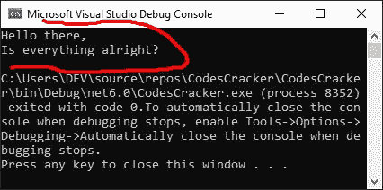

# C#基本语法

> 原文：<https://codescracker.com/c-sharp/c-sharp-basic-syntax.htm>

创建这篇文章是为了提供关于 C#程序基本语法的信息。这就是如何编写一个基本的 C#程序。所以没有任何进一步的拖延，让我们开始教程。

C#程序最基本的语法应该是:

```
using System;
namespace MyNamespaceName
{
   class MyClassName
   {
      static void Main(string[] args)
      {
         // block of code
      }
   }
}
```

这是一个基本 C#程序的语法。在 C#教程的[开头，我已经解释了用上述基本语法编写的所有术语和语句。这是我提供的链接，可以帮助你直接进入 的描述部分。但是现在，让我创建一个 C#程序的上述基本语法的例子。](/c-sharp/index.htm#basicsyntax)

```
using System;
namespace MyFirstCSharpProgram
{
    class MyClassXYZ
    {
        static void Main(string[] args)
        {
            Console.WriteLine("Hello there,");
            Console.WriteLine("Is everything alright?");
        }
    }
}
```

因为我使用“微软 Visual Studio”作为我的 IDE 来用 C#编程。因此，当我在其中执行上述程序时，下面是我得到的输出:



我用红色半圆突出显示了输出文本，以便您可以直接关注它。遗憾的🤥它看起来不像一个半圆，但请只关注输出文本😏。

[C#在线测试](/exam/showtest.php?subid=11)

* * *

* * *