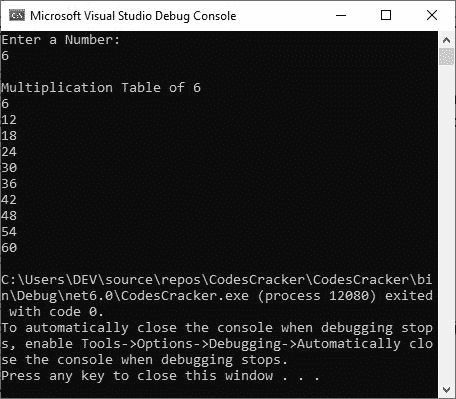
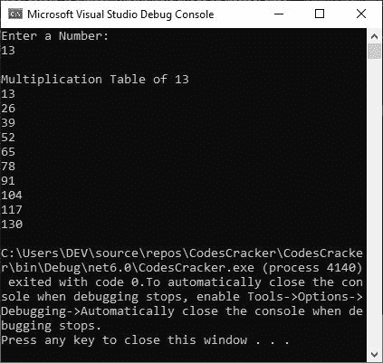

# C#循环示例| for、while 和 do-while 循环

> 原文：<https://codescracker.com/c-sharp/c-sharp-loops.htm>

当我们需要按照要求的次数执行某个代码块时，就会使用 C#或任何其他编程语言中的循环。或者我们可以使用一个循环来继续执行某个已定义的代码块，直到指定的条件评估为 false。

我们将讨论三种类型的循环，它们是:

*   [而](#a)
*   [做...而](#b)
*   [为](#c)
*   [foreach](#d)

## C# while 循环

C#中 while 循环的一般形式是:

```
while (condition)
{
   // block of code to continue
   // its execution until the 
   // condition evaluates to be false
}
```

例如

```
Console.WriteLine("Enter a Number: ");
int num = Convert.ToInt32(Console.ReadLine());

int i = 1;

Console.WriteLine("\nMultiplication Table of {0}", num);
while (i <= 10)
{
    Console.WriteLine(num * i);
    i++;
}
```

使用用户输入 3 运行的示例应该完全如下面给出的快照所示。



上述 C#程序的预演应该是:

*   使用第一行代码，字符串或文本“输入一个数字:”将被打印在输出控制台上。
*   当用户键入一个值并按回车键时，该值将使用第二行代码初始化为变量 **num** 。
*   使用第三行代码，1 将被初始化为变量 **i** 。
*   使用第四行代码，将使用 **\n** 插入一个新行，然后文本“乘法表 3”(3 是用户在程序运行时输入的数字 )将打印在输出控制台上。
*   现在将评估 **while** 循环的条件。
*   因为条件 **i < = 10** 或 **1 < = 10** 评估为**真**。因此，程序流进入循环内部并执行 其中的两条 C#语句。
*   第一条语句打印出 **num * i** 的值，它将是 **3 * 1** 或 **3** 。并且使用第二个语句， **i** 的值将增加 1。因此现在 **i = 2**
*   再次用新值评估 **while** 循环的条件。即 **i < = 10** 或 **2 < = 10** 再次评估为 为**真**，因此程序流程再次进入循环内部。
*   这个过程继续，直到条件被评估为**假**。

## C# do...while 循环

**做什么...虽然**循环的工作方式类似于 **while** 循环，但是循环内部的代码块将立即执行，即使 定义的条件最初被评估为假。下面是**做的一般形式...而**在 C#中循环:

```
do
{
   // block of code to be executed
   // at first, and then continue 
   // its execution until the 'condition'
   // evaluates to be false
} while (condition);
```

例如:

```
int num = 10;
do
{
    Console.WriteLine("Inside the do...while loop");
} while (num < 0);
```

从这个 C#例子中可以看出，条件 **num < 0** 或 **10 < 0** 在第一次求值时为假。但是，在**中的 代码块仍然有效...而**循环将被执行。因此，输出应该完全是:

```
Inside the do...while loop
```

现在让我创建另一个例子，它的工作与在 **while** 循环中使用的例子相同:

```
Console.WriteLine("Enter a Number: ");
int num = Convert.ToInt32(Console.ReadLine());

int i = 1;

Console.WriteLine("\nMultiplication Table of {0}", num);
do
{
    Console.WriteLine(num * i);
    i++;
} while (i <= 10);
```

现在，在用户输入数字 7 的情况下，这个 C#示例的示例运行显示了...而循环工作应该是:

```
Enter a Number:
7

Multiplication Table of 7
7
14
21
28
35
42
49
56
63
70
```

## C# for 循环

不像**而**和**所做的...当**循环时，循环的**将初始化、条件检查和更新语句全部集中在 中。下面是 C#中循环的*的一般形式:***

```
for (initialize; condition; update)
{
   // block of code to be executed
   // until the "condition" evaluates 
   // to be false
}
```

在循环开始时， **initialize** 语句将被执行一次。每次在 进入循环之前，都会执行**条件**语句。在执行完循环中定义的所有代码块后，将执行**更新**语句。例如:

```
Console.WriteLine("Enter a Number: ");
int num = Convert.ToInt32(Console.ReadLine());

Console.WriteLine("\nMultiplication Table of {0}", num);
for (int i=1;  i <= 10; i++)
    Console.WriteLine(num * i);
```

通过用户输入 13，这个 C#示例的运行示例显示在下面给出的快照中。



## C# foreach 循环

当我们需要遍历指定数组的每个元素时，就会用到 **foreach** 循环。以下是 C#中 foreach 循环的一般形式。

```
foreach (type x in array) 
{
   // block of code to be executed
   // until the last element of the 
   // array
}
```

例如:

```
string[] cities = { "Boston", "Dallas", "Houston", "El Paso", "Phoenix" };
foreach(string x in cities)
{
    Console.WriteLine(x);
}
```

输出应该正好是:

```
Boston
Dallas
Houston
El Paso
Phoenix
```

[C#在线测试](/exam/showtest.php?subid=11)

* * *

* * *