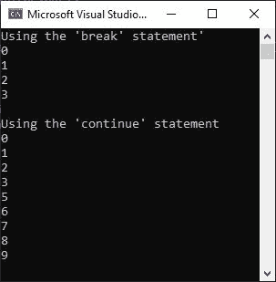

# C#中 break 和`continue`语句的区别

> 原文：<https://codescracker.com/c-sharp/c-sharp-break-continue.htm>

当我们需要退出当前循环时，我们使用`break`语句。另一方面，`continue`语句用于为下一次迭代继续当前循环，跳过当前迭代语句之后可用代码块的执行。例如:

```
Console.WriteLine("Using the 'break' statement'");
for (int i = 0; i < 10; i++)
{
    if (i == 4)
        break;
    Console.WriteLine(i);
}

Console.WriteLine("\nUsing the 'continue' statement");
for (int i = 0; i < 10; i++)
{
    if (i == 4)
        continue;
    Console.WriteLine(i);
}
```

下面给出的快照显示了这个 C#示例产生的示例输出。



从上面演示 break 和`continue`语句的 C#示例中可以看出，在第一个`for`循环中，当条件 i == 4 的计算结果为 true 时，将执行`break`语句，程序流将退出循环。而“继续”语句则有不同的情况。也就是说，在第二个`for`循环中，当相同的条件评估为真时，执行`continue`语句，并且在该迭代的执行过程中跳过`continue`语句之后的语句。然后，程序流转移到循环的下一次迭代。

[C#在线测试](/exam/showtest.php?subid=11)

* * *

* * *