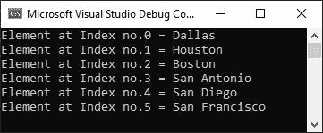

# C#中的数组及示例

> 原文：<https://codescracker.com/c-sharp/c-sharp-arrays.htm>

当我们需要在单个变量中存储多个相同类型的值时，就要使用 C#中的数组。现在你可能会有一个问题，如果一个变量包含多个值，那么我们如何访问任何一个特定的值？
答案很简单，就是通过索引。我将在本页稍后解释数组元素的访问。但是现在，让我们看看 在 C#中创建数组的一般形式。

```
type[] arrayName = new type[size];
```

例如:

```
string[] cities = new string[6];
```

上面的语句创建了一个名为“cities”的数组，我们可以在其中添加六个元素或值。例如:

```
cities = new string[6] {"Dallas", "Houston", "Boston", "San Antonio", "San Diego", "San Francisco"};
```

但是，您也可以在声明时将所需数量的值或元素初始化为数组。例如:

```
string[] cities = { "Dallas", "Houston", "Boston", "San Antonio", "San Diego", "San Francisco" };
```

由于数组中的索引从 0 开始，因此，城市[0]将指“达拉斯”，城市[1]将指“休斯顿”，依此类推。

现在让我实现这些代码来创建一个合适的例子，在这个例子中，我们将创建一个数组，然后在输出控制台上打印它的值。

```
string[] cities = { "Dallas", "Houston", "Boston", "San Antonio", "San Diego", "San Francisco" };

Console.WriteLine("Element at Index no.0 = " + cities[0]);
Console.WriteLine("Element at Index no.1 = " + cities[1]);
Console.WriteLine("Element at Index no.2 = " + cities[2]);
Console.WriteLine("Element at Index no.3 = " + cities[3]);
Console.WriteLine("Element at Index no.4 = " + cities[4]);
Console.WriteLine("Element at Index no.5 = " + cities[5]);
```

下面给出的快照显示了上面的 C#示例产生的输出，演示了数组。



## 在 C#中查找数组的长度

为了找到数组的长度，我们将通过两种方式来完成，一种是使用 C#预定义的属性，另一种是使用 [foreach 循环](/c-sharp/c-sharp-loops#d)。让我们从名为 Length 的预定义属性开始。

```
string[] cities = { "Dallas", "Houston", "Boston", "San Antonio", "San Diego", "San Francisco" };

Console.WriteLine("Length = " + cities.Length);
```

输出应该正好是:

```
Length = 6
```

现在让我用第二个例子来找出 C#中数组的长度。

```
string[] cities = { "Dallas", "Houston", "Boston", "San Antonio", "San Diego", "San Francisco" };

int i = 0;
foreach (string x in cities)
    i++;

Console.WriteLine("Length = " + i);
```

您将获得相同的输出。在这个例子中，我使用了 foreach 循环，它用于遍历指定数组的每个元素。因此，不用使用 idexes 来访问所有数组元素，您可以用 foreach 循环以这种方式来处理它。

```
string[] cities = { "Dallas", "Houston", "Boston", "San Antonio", "San Diego", "San Francisco" };

foreach (string x in cities)
    Console.WriteLine(x);
```

上述 C#示例的输出应该完全是:

```
Dallas
Houston
Boston
San Antonio
San Diego
San Francisco
```

你也可以用这种方式在程序中随时改变数组。

```
string[] cities = { "Dallas", "Houston", "Boston", "San Antonio", "San Diego", "San Francisco" };

Console.WriteLine("---Original Array---");
for (int i = 0; i < cities.Length; i++)
    Console.Write(cities[i] + "     ");

Console.WriteLine("\n\nChaging the Elements of the Array...");
cities[2] = "Paris";
cities[4] = "Toronto";

Console.WriteLine("\n---New Array after Change---");
for (int i = 0; i < cities.Length; i++)
    Console.Write(cities[i] + "     ");
```

输出应该正好是:

```
---Original Array---
Dallas     Houston     Boston     San Antonio     San Diego     San Francisco

Chaging the Elements of the Array...

---New Array after Change---
Dallas     Houston     Paris     San Antonio     Toronto     San Francisco
```

[C#在线测试](/exam/showtest.php?subid=11)

* * *

* * *