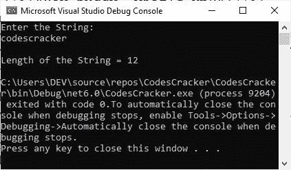

# C#中的字符串及示例

> 原文：<https://codescracker.com/c-sharp/c-sharp-strings.htm>

在 C#中，要在变量中存储文本数据，我们必须使用字符串类型。C#中的字符串是字符的组合。例如:

*   “C#好玩！”
*   “代码 scracker”
*   “嘿伙计，怎么了？”

**请注意:**字符串包含在引号内。

下面的例子展示了我们如何在 C#中创建一个字符串类型的变量。

```
string myvar;
```

要将任何字符串值初始化为字符串类型变量，只需引用字符串或文本，并以这种方式将其初始化为变量。

```
string myvar = "codescracker.com";
```

## C#字符串示例

现在让我用 C#创建一个演示字符串的例子。该示例将接收用户的输入，并将输入的数据打印回输出控制台。

```
Console.WriteLine("Enter anything: ");
string mytext = Console.ReadLine();

Console.WriteLine("You entered: " + mytext);
```

下面给出的快照显示了上面的 C#示例在执行后的示例运行。我在 Microsoft Visual Studio 中执行了这段 C#代码后拍摄了这张快照。


我使用了一条红线来吸引您对与程序相关的输出文本的注意。我用过“学 C#很好玩！”作为输入。

## 在 C#中计算字符串的长度

要查找指定字符串的长度，请使用 C# **Length** 属性。下面是一个演示 Length 属性用法的示例。

```
Console.WriteLine("Enter the String: ");
string str = Console.ReadLine();

Console.WriteLine("\nLength of the String = " + str.Length);
```

使用用户输入“codescracker”运行的示例应该完全是



## 在 C#中将大写字符串转换为小写

要将一个大写字符串转换成它的小写对应字符串，可以这样使用 **ToLower()** 方法。

```
string x = "CODESCRACKER";
string y = "C# Programming is Fun!";

Console.WriteLine(x.ToLower());
Console.WriteLine(y.ToLower());
```

输出应该正好是:

```
codescracker
c# programming is fun!
```

## 在 C#中将小写字符串转换为大写

要将小写字符串转换成大写字符串，可以这样使用 **ToUpper()** 方法。

```
string x = "codescracker";
string y = "C# Programming is Fun!";

Console.WriteLine(x.ToUpper());
Console.WriteLine(y.ToUpper());
```

输出应该正好是:

```
CODESCRACKER
C# PROGRAMMING IS FUN!
```

## C#中的字符串串联

C#中的字符串连接可以通过使用 **Concat()** 方法以这种方式完成。

```
string x = "codescracker";
string y = "C# Programming is Fun!";

Console.WriteLine(string.Concat(x, y));
```

输出应该正好是:

```
codescrackerC# Programming is Fun!
```

您也可以使用 **+** 操作符以这种方式执行字符串连接。

```
string x = "codescracker";
string y = "C# Programming is Fun!";

Console.WriteLine(x + y);
```

您将获得与上一个示例相同的输出。

[C#在线测试](/exam/showtest.php?subid=11)

* * *

* * *