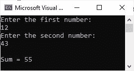

# C#程序将两个数相加

> 原文：<https://codescracker.com/c-sharp/c-sharp-add-two-numbers.htm>

发布这个帖子是为了在 C#中添加两个数。首先，我将处理一个不接收任何用户输入的程序。然后，我将创建另一个程序，该程序允许用户输入两个数字，这两个数字将被相加，相加的结果将被打印回输出控制台。

## 简单的 C#代码来添加两个数字

首先，让我创建一个将两个数相加的简单 C#程序。

```
int a = 10;
int b = 20;
int sum = a + b;

Console.WriteLine("Sum = " + sum);
```

输出应该正好是:

```
Sum = 30
```

同样的程序也可以用这种方法创建。

```
int a = 10, b = 20;

Console.WriteLine("Sum = {0}", a + b);
```

**注意:**如果使用“Sum = " + a + b”，那么 a 和 b 都将被视为字符串。

## 添加用户输入的两个数的 C#代码

现在让我创建另一个 C#程序，它将添加并打印用户在程序运行时输入的两个数字的相加结果。

```
Console.WriteLine("Enter the first number: ");
int a = Convert.ToInt32(Console.ReadLine());
Console.WriteLine("Enter the second number: ");
int b = Convert.ToInt32(Console.ReadLine());

Console.WriteLine("\nSum = {0}", a + b);
```

下面给出的快照显示了在用户输入 12 和 43 这两个数字后，这个 C#示例的运行示例。



我已经在 C#教程的主页上定义了如何从用户那里接收输入，你可以很容易的找到。

[C#在线测试](/exam/showtest.php?subid=11)

* * *

* * *