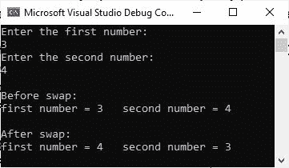

# 交换两个数的 C#程序

> 原文：<https://codescracker.com/c-sharp/c-sharp-swap-two-numbers.htm>

发表这篇文章是为了提供 C#中用来交换两个数的信息和程序。我已经创建了两个 C#程序，一个没有用户输入，另一个有用户输入。

让我澄清一件事:我不会使用任何第三个或临时变量来交换两个数字。

## 交换两个数的简单 C#程序

现在让我创建一个简单的 C#程序，它交换两个数字而不使用第三个变量。此外，我不允许用户通过这个程序输入任何数据。

```
int numOne = 10;
int numTwo = 20;

Console.WriteLine("Before swap:");
Console.WriteLine("'numOne' = " + numOne + "   'numTwo' = " + numTwo);

numOne = numOne + numTwo;
numTwo = numOne - numTwo;
numOne = numOne - numTwo;

Console.WriteLine("\nAfter swap:");
Console.WriteLine("'numOne' = " + numOne + "   'numTwo' = " + numTwo);
```

这个 C#示例产生的输出应该完全是

```
Before swap:
'numOne' = 10   'numTwo' = 20

After swap:
'numOne' = 20   'numTwo' = 10
```

## 交换用户输入的两个数的 C#程序

这个 C#程序在运行时接收用户输入的两个数字。然后，这两个数字将被交换并打印回输出控制台。

```
int a, b;

Console.WriteLine("Enter the first number: ");
a = Convert.ToInt32(Console.ReadLine());
Console.WriteLine("Enter the second number: ");
b = Convert.ToInt32(Console.ReadLine());

Console.WriteLine("\nBefore swap:");
Console.WriteLine("first number = " + a + "   second number = " + b);

a = a + b;
b = a - b;
a = a - b;

Console.WriteLine("\nAfter swap:");
Console.WriteLine("first number = " + a + "   second number = " + b);
```

这个 C#程序使用用户输入 3 和 4 产生的输出显示在下面给出的快照中。



[C#在线测试](/exam/showtest.php?subid=11)

* * *

* * *