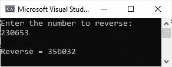

# 反转一个数字的 C#程序

> 原文：<https://codescracker.com/c-sharp/c-sharp-reverse-a-number.htm>

发表这篇文章是为了向我们的用户展示我们如何使用 C#程序来反转一个数字。例如，如果数字是 236，它的倒数应该是 632。

## 简单的 C#程序来反转一个数字

让我先用 C#创建一个简单的程序，它可以反转一个数字，比如说 2945。

```
int num = 2945;
int rem, rev = 0;

while(num != 0)
{
    rem = num % 10;
    rev = rem + (rev * 10);
    num = num / 10;
}

Console.WriteLine("Reverse = " +rev);
```

这个显示一个数的倒数的 C#程序应该打印出来如下:

```
Reverse = 5492
```

## 反转用户输入数字的 C#程序

现在让我创建另一个 C#程序，它做的工作与上一个相同，但是这个程序允许用户输入数字。

```
int num, rem, rev = 0;

Console.WriteLine("Enter the number to reverse: ");
num = Convert.ToInt32(Console.ReadLine());

while(num != 0)
{
    rem = num % 10;
    rev = rem + (rev * 10);
    num = num / 10;
}

Console.WriteLine("\nReverse = " +rev);
```

对于用户输入 230653，这个 C#示例产生的输出显示在下面给出的快照中，这是我在 Microsoft Visual Studio IDE 中执行这个程序时拍摄的。



[C#在线测试](/exam/showtest.php?subid=11)

* * *

* * *