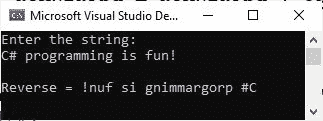

# 反转字符串的 C#程序

> 原文：<https://codescracker.com/c-sharp/c-sharp-reverse-string.htm>

发表这篇文章是为了向你展示 C#中的信息和程序，展示我们如何反转一个字符串。我创建了两个程序，一个有用户输入，另一个没有用户输入。

## 简单的 C#程序来反转一个字符串

让我首先创建一个 C#程序，它反转一个字符串，并在输出控制台上打印字符串的反转。这个程序不允许用户输入任何信息。

```
string origString = "codescracker";
string revString = "";
int len;

len = origString.Length - 1;

while (len >= 0)
{
    revString = revString + origString[len];
    len--;
}

Console.WriteLine("Reverse = " + revString);
```

这个 C#程序产生的输出应该完全是:

```
Reverse = rekcarcsedoc
```

同样的 C#程序也可以写成

```
string origString = "codescracker", revString = "";

for (int len = origString.Length - 1; len >= 0; len--)
    revString = revString + origString[len];

Console.WriteLine("Reverse = " + revString);
```

## 反转用户输入字符串的 C#程序

现在让我创建另一个 C#程序来做同样的事情，除了这个程序在运行时从用户那里接收一个字符串。

```
string origString, revString = ""; 

Console.WriteLine("Enter the string: ");
origString = Console.ReadLine();

for (int len = origString.Length - 1; len >= 0; len--)
    revString = revString + origString[len];

Console.WriteLine("\nReverse = " + revString);
```

示例运行时，用户输入“C#编程很有趣！”如下图所示。



[C#在线测试](/exam/showtest.php?subid=11)

* * *

* * *