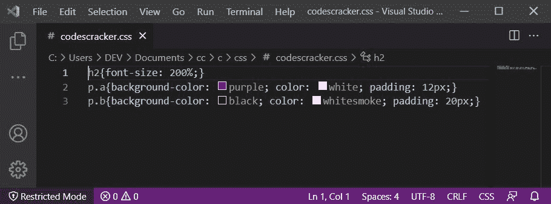

# 在 HTML 中何处编写 CSS 代码

> 原文：<https://codescracker.com/css/css-inclusion.htm>

CSS 代码可以在以下位置/方式编写，以将样式应用于 HTML 元素:

*   内嵌 CSS
*   内部 CSS
*   外部 CSS

## 内嵌 CSS

内联 CSS 可以用来设计特定的 HTML 元素。要编写内联 CSS，请使用以下语法:

```
<ELEMENT style="property1:value1; property2:value2; ...; propertyN:valueN;"></ELEMENT>
```

例如:

HTML with CSS Code

```
<!DOCTYPE html>
<html>
<body>

   <h2>Where to Write Inline CSS Code</h2>
   <p>The paragraph given below is styled using inline CSS.</p>
   <p style="background-color: purple; color: white; padding: 12px;">CODESCRACKER</p>

</body>
</html>
```

Output

## 在哪里编写内联 CSS 代码

下面给出的段落使用内联 CSS 样式。

CODESCRACKER

**注意-** 编写 CSS 代码的[语法在它的单独的 教程中有描述。](/css/css-syntax.htm)

### 内联 CSS 的主要优势

*   作为 HTML 元素的内联 CSS 编写的 CSS 代码优先于内部和外部 CSS

### 内联 CSS 的主要缺点

*   内嵌 CSS 增加了维护难度和下载时间
*   [伪元素](/css/css-pseudo-elements.htm)和/或[伪类](/css/css-pseudo-classes.htm) 不能使用内联 CSS

## 内部 CSS

内部 CSS 被用来设计特定的网页。内部 CSS 写在 **STYLE** 标签里面，那肯定是在 HTML 文档的 **HEAD** 里面。下面是语法:

```
<!DOCTYPE html>
<html>
<head>
   <style type="text/css">
      Selector1{property1: value1; property2: value2; ...; propertyN: valueN;}
      Selector2{property1: value1; property2: value2; ...; propertyN: valueN;}
	  .
	  .
	  .
      SelectorN{property1: value1; property2: value2; ...; propertyN: valueN;}
   </style>
</head>
<body>

   ...The Content of HTML Document's BODY goes here...

</body>
</html>
```

例如:

HTML with CSS Code

```
<!DOCTYPE html>
<html>
<head>
   <style>
      p{background-color: purple; color: white; padding: 12px;}
   </style>
</head>
<body>

   <p>CODESCRACKER</p>

</body>
</html>
```

Output

CODESCRACKER

与内联 CSS 相比，内部 CSS 的优势在于，如果我们想要设计所有段落的样式，而不需要为每个段落编写 CSS，那么内部 CSS 可以帮助我们完成这个任务。例如:

HTML with CSS Code

```
<!DOCTYPE html>
<html>
<head>
   <style>
      p{background-color: purple; color: white; padding: 12px;}
   </style>
</head>
<body>

   <h2>Where to Write Internal CSS Code</h2>
   <p>All the paragraphs are styled</p>
   <p>CODESCRACKER</p>
   <p>This is the third paragraph</p>

</body>
</html>
```

Output

## 在哪里编写内部 CSS 代码

所有的段落都是有风格的

CODESCRACKER

这是第三段

看，所有这三个段落都是用一个 CSS 声明设计的。现在的问题是，如果我们只需要设计两个段落，或者两个段落用一个，最后一个用另一个。然后，我们需要为段落定义类和/或 id，或者使用伪类进行识别和/或选择。例如:

HTML with CSS Code

```
<!DOCTYPE html>
<html>
<head>
   <style>
      h2{font-size: 200%;}
      p.a{background-color: purple; color: white; padding: 12px;}
      p.b{background-color: black; color: whitesmoke; padding: 20px;}
   </style>
</head>
<body>

   <h2>Where to Write Internal CSS in HTML Document</h2>
   <p class="a">All the paragraphs are styled</p>
   <p class="a">CODESCRACKER</p>
   <p class="b">This is the third paragraph</p>

</body>
</html>
```

Output

## 在 HTML 文档中何处编写内部 CSS

所有的段落都是有风格的

CODESCRACKER

这是第三段

在即将到来的 教程中，你会学到关于[选择器](/css/css-selectors.htm)和伪类的所有知识。现在，事情是这样的，内部 CSS 代码可以用 HTML 文档编写，就像上面的 例子一样。

### 内部 CSS 的主要优势

*   仅影响编写内部 CSS 的页面

### 内部 CSS 的主要缺点

*   由于内部 CSS 是为每个页面编写的，因此如果我们需要改变/更新一些样式，那么我们必须为每个页面做同样的改变/更新

## 外部 CSS

外部 CSS 写在扩展名必须是**的外部文件中。css** 说 **codescracker.css** 。 例如，在一个新文件中编写下面的 CSS 代码:

```
h2{font-size: 200%;}
p.a{background-color: purple; color: white; padding: 12px;}
p.b{background-color: black; color: whitesmoke; padding: 20px;}
```

现在保存文件，文件名为 **codescracker** 后跟**。css** 扩展。下面是文件的快照 :



现在，因为 CSS 代码是在一个外部文件中编写的，所以我们需要将该文件链接到 HTML 文档，我们希望将在该外部 CSS 文件中编写的 CSS 应用到该 HTML 文档。

在 HTML 文档中包含外部 CSS 文件的语法是:

```
<link rel="stylesheet" type="text/css" href="ExternalCSSFileURL">
```

将外部 CSS 文件包含到 HTML 文档中的另一种方法是:

```
<style>
   @import url("ExternalCSSFileURL");
</style>
```

例如:

HTML with CSS Code

```
<!DOCTYPE html>
<html>
<head>
   <link rel="stylesheet" href="codescracker.css">
</head>
<body>

   <h2>Where to Write and Link External CSS in HTML</h2>
   <p class="a">This is the first paragraph</p>
   <p class="a">This is another paragraph</p>
   <p class="b">This is the last paragraph of this Document</p>

</body>
</html>
```

Output

## 在 HTML 中何处编写和链接外部 CSS

这是第一段

这是另一个段落

这是本文件的最后一段

在上面的例子中，我只写了外部 CSS 文件的文件名，因为 HTML 文档和 CSS 保存在同一个目录中。但是您仍然可以提供外部 CSS 文件的完整 URL。

**注意-** 如果外部 CSS 文件没有保存在保存 HTML 文件的目录中，那么 包括 CSS 文件的完整 URL。

**注意-** 你也可以提供外部 CSS 文件的完整 URL，而不用关心 HTML 文档 保存在哪里。

### 外部 CSS 的主要优势

*   维护变得容易了
*   要改变整个网站的风格，我们只需要更新一个 CSS 文件
*   一次编写，随处使用

### 外部 CSS 的主要缺点

*   增加了页面加载时间，因为页面只有在外部 CSS 文件中写入的整个 CSS 代码加载后才加载

[CSS 在线测试](/exam/showtest.php?subid=5)

* * *

* * *