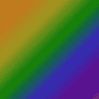

# CSS 边框-图像-切片

> 原文：<https://codescracker.com/css/css-border-image-slice.htm>

CSS **border-image-slice** 属性用于指定图像的切片方式，用于元素的边框 。例如:

HTML with CSS Code

```
<!DOCTYPE html>
<html>
<head>
   <style>
      p {border: 15px solid transparent; padding: 12px;
         border-image-source: url(images/border-image-demo.png);
         border-image-repeat: repeat;}
      p#one {border-image-slice: 1;}
      p#two {border-image-slice: 15;}
      p#three {border-image-slice: 50;}
   </style>
</head>
<body>

   <p id="one">This is a para.</p>
   <p id="two">This is para two.</p>
   <p id="three">This is the last para.</p>

</body>
</html>
```

Output

这是一个段落。

这是第二段。

这是最后一段。

在上面的程序中，使用的图像是:



## CSS 边框图像切片语法

CSS 中 **border-image-slice** 属性的语法是:

```
border-image-slice: x;
```

**x** 的值应该是下列值之一:

*   **号** -用于定义切片图像的像素
*   **%** -用于定义切片相对于图像的宽度和高度
*   **初始** -用于设置默认值
*   **继承** -用于继承和设置其父代的值

**注意-****fill**关键字后跟 **x** ，可以用来填充图像到元素的中间 。例如:

HTML with CSS Code

```
<!DOCTYPE html>
<html>
<head>
   <style>
      p {border: 15px solid transparent; padding: 12px; color: white;
         border-image-source: url(images/border-image-demo.png);}
      p#one {border-image-repeat: round; border-image-slice: 10 fill;}
      p#two {border-image-repeat: repeat; border-image-slice: 10 fill;}
      p#three {border-image-repeat: stretch; border-image-slice: 10 fill;}
   </style>
</head>
<body>

   <p id="one">This is a para.</p>
   <p id="two">This is para number two.</p>
   <p id="three">This is the third para.</p>

</body>
</html>
```

Output

这是一个段落。

这是第二段。

这是第三段。

### 具有多个值的 CSS 边框图像切片

我们也可以使用多个值定义**边界图像切片**。

*   如果给定了四个值，那么第一个值指的是顶部，第二个值指的是右侧，第三个值指的是底部，第四个值指的是左侧边框
*   如果给定了三个值，那么第一个值指的是顶部，第二个值指的是右侧和左侧，最后一个值指的是底部边框
*   如果给定两个值，那么第一个值指的是顶部和底部，而第二个值指的是右边界和左边界

例如:

HTML with CSS Code

```
<!DOCTYPE html>
<html>
<head>
   <style>
      p {border: 18px solid transparent; padding: 30px 10px;
         border-image-source: url(images/border-image-demo.png);}
      p#one {border-image-repeat: repeat; border-image-slice: 1 50 10 30;}
      p#two {border-image-repeat: repeat; border-image-slice: 1 50 10;}
      p#three {border-image-repeat: repeat; border-image-slice: 1 50;}
      p#four {border-image-repeat: repeat; border-image-slice: 1;}
   </style>
</head>
<body>

   <p id="one">This is a para.</p>
   <p id="two">This is para number two.</p>
   <p id="three">This is the third para.</p>
   <p id="four">This is the last or fourth para.</p>

</body>
</html>
```

Output

这是一个段落。

这是第二段。

这是第三段。

这是最后或第四段。

**注意-** 用于边框的图像被分割成九个部分。所有九个部分被分成 四个边缘、四个角落和中间。**填充**关键字用于用相同的图像填充中间， 用作边框。

**让我澄清一下-** 上面例子中使用的数字是像素，不是节。

[CSS 在线测试](/exam/showtest.php?subid=5)

* * *

* * *