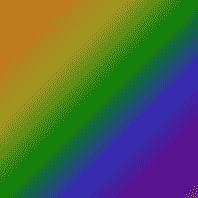

# CSS 边框-图像-重复

> 原文：<https://codescracker.com/css/css-border-image-repeat.htm>

CSS**CSS border-image-repeat**属性用于指定边框图像是否应该重复 。例如:

HTML with CSS Code

```
<!DOCTYPE html>
<html>
<head>
   <style>
      p {border: 10px solid transparent; padding: 12px;
         border-image-source: url(images/border-image-demo.png);
         border-image-slice: 24;}
      p#one {border-image-repeat: repeat;}
      p#two {border-image-repeat: space;}
      p#three {border-image-repeat: round;}
      p#four {border-image-repeat: stretch;}
   </style>
</head>
<body>

   <p id="one">This is a para.</p>
   <p id="two">This is another para.</p>
   <p id="three">This is para three.</p>
   <p id="four">This is the last para.</p>

</body>
</html>
```

Output

这是一个段落。

这是另一个段落。

这是第三段。

这是最后一段。

在上面的程序中，使用的图像是:



## CSS 边框-图像-重复语法

CSS 中 **border-image-repeat** 属性的语法是:

```
border-image-repeat: x;
```

**x** 的值应该是下列值之一:

*   **重复** -用于重复图像以填充边界区域
*   **回合**——同*重复*。但是如果边界区域没有被平铺或重复的 图像完全填充，那么图像会被重新缩放并用于填充整个边界区域
*   **拉伸** -用于拉伸图像以填充边界区域。这是默认值
*   **空间** -用于用重复或平铺的图像填充边框。如果它没有用所有的图块完全填充 的边界区域，那么所有图块的周围就会有额外的空间
*   **初始** -用于设置默认值
*   **继承** -用于继承其父代的值

让我们创建另一个示例来区分**边框-图像-重复** 属性的**重复**和**圆形**值:

HTML with CSS Code

```
<!DOCTYPE html>
<html>
<head>
   <style>
      p {border: 15px solid transparent; padding: 12px;
         border-image-source: url(images/border-image-demo.png);
         border-image-slice: 1;}
      p#one {border-image-repeat: repeat;}
      p#two {border-image-repeat: round;}
   </style>
</head>
<body>

   <p id="one">This is para one.</p>
   <p id="two">This is para two.</p>

</body>
</html>
```

Output

这是第一段。

这是第二段。

在两种情况下都可以看到边界的拐角。圆形的看起来更吸引人。

[CSS 在线测试](/exam/showtest.php?subid=5)

* * *

* * *