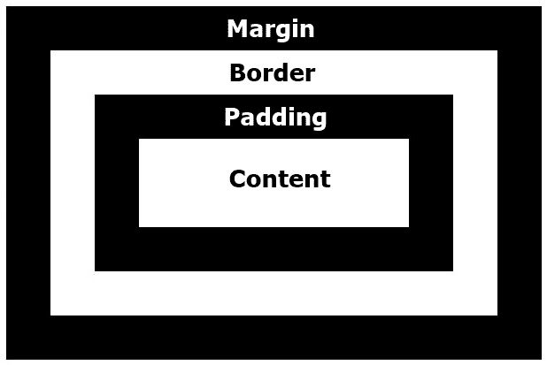

# CSS 盒子模型

> 原文：<https://codescracker.com/css/css-box-model.htm>

本文旨在描述 CSS 中的盒子模型。因为在每个 HTML 元素周围，都有一个不可见的框，它由以下部分组成:

*   盒子里的东西
*   [填充](/css/css-padding.htm) -在边框和指定元素的内容 之间创建空间或间隙
*   [Borders](/css/css-border.htm) -在一个元素周围创建一个边框。
*   [边距](/css/css-margin.htm) -在指定元素周围创建空白区域或空间。如果 元素有边框，那么在指定元素的边框周围创建边距

如下图所示:



例如:

HTML with CSS Code

```
<!DOCTYPE html>
<html>
<head>
   <style>
      div.a{padding: 12px; border: 4px solid red;}
      div.b{margin: 40px; border: 1px solid blue;}
      div.c{padding: 12px; background-color: gray;}
      div.d{width: 120px; height: 80px; padding: 18px;
         border: 12px solid green; margin: 40px;}
   </style>
</head>
<body>

   <div class="a">
      Lorem ipsum dolor sit amet consectetur adipisicing elit.
   </div>
   <div class="b">
      Lorem ipsum dolor sit amet consectetur.
   </div>
   <div class="c">
      Lorem ipsum dolor sit amet.
   </div>
   <div class="d">
      Lorem ipsum dolor sit amet consectetur, adipisicing elit.
   </div>

</body>
</html>
```

OutputLorem ipsum dolor sit amet consectetur adipisicing elit.Lorem ipsum dolor sit amet consectetur.Lorem ipsum dolor sit amet.Lorem ipsum dolor sit amet consectetur, adipisicing elit.

[CSS 在线测试](/exam/showtest.php?subid=5)

* * *

* * *