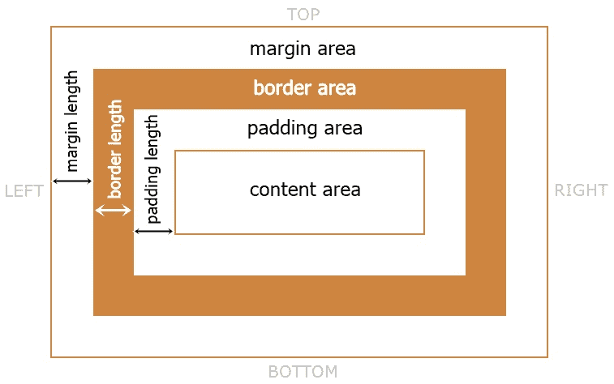

# CSS 填充

> 原文：<https://codescracker.com/css/css-padding.htm>

CSS **padding** 属性用于在 [边框](/css/css-border.htm)和指定元素的内容之间创建空间或间隙。例如:

HTML with CSS Code

```
<!DOCTYPE html>
<html>
<head>
   <style>
      .a, .b{border: 2px solid red;}
      .b{padding: 24px;}
   </style>
</head>
<body>

   <div class="a">
      Without padding
   </div>

   <br/>

   <div class="b">
      With padding of 24px
   </div>

</body>
</html>
```

OutputWithout padding
With padding of 24px

填充基本上是内容周围和元素边框内部的可用空间。考虑下图，以了解填充的实际位置:



如果一个元素没有定义任何边框，那么也会在该元素周围创建填充。例如:

HTML with CSS Code

```
<!DOCTYPE html>
<html>
<head>
   <style>
      div{padding: 62px;}
   </style>
</head>
<body>

   <div>
      Lorem ipsum dolor sit amet consectetur, adipisicing elit.
   </div>

</body>
</html>
```

OutputLorem ipsum dolor sit amet consectetur, adipisicing elit.

## CSS 填充语法

CSS 中**填充**属性的语法是:

```
padding: padding-top padding-right padding-bottom padding-left;
```

因此，**填充**属性也可以被调用/用作这些填充属性的简写:

*   [填充-顶部](/css/css-padding-top.htm) -用于创建顶部填充
*   [填充-右侧](/css/css-padding-right.htm) -用于创建右侧填充
*   [底部填充](/css/css-padding-bottom.htm) -用于创建底部填充
*   [左填充](/css/css-padding-left.htm) -用于创建左填充

**注意-** 所有这些填充值都是用[长度单位](/css/css-length-units.htm)定义的。 同样，我们可以使用单个值或多个(最多 4 个)值来定义**填充**属性。

### 用四个值填充的 CSS

*   第一个值应该应用于顶部填充
*   第二个值应该应用于右填充
*   第三个值应该应用于底部填充
*   第四个值应该应用于左填充

例如:

HTML with CSS Code

```
<!DOCTYPE html>
<html>
<head>
   <style>
      p{border: 2px solid crimson; padding: 20px 40px 10px 60px;}
   </style>
</head>
<body>

   <p>Lorem ipsum dolor sit amet consectetur adipisicing elit. Praesentium
      nulla eius rerum, animi, tenetur blanditiis iure inventore quia est
      ipsum minima repellendus dolore beatae illo totam consequuntur ullam
      accusantium laudantium numquam earum voluptates quis?</p>

</body>
</html>
```

Output

Lorem ipsum 疼痛静坐 amet 结果肥胖精英。pradesium nothing eius rerum，animi，tentur blandiis iu inventor who is ipsum minimal repelled pain beatae illo totam consequent ullam 控告某个任性的耳膜上的鸦片酊？

### 用三个值填充的 CSS

*   第一个值应该应用于顶部填充
*   第二个值应该应用于左右填充
*   第三个值应该应用于底部填充

例如:

HTML with CSS Code

```
<!DOCTYPE html>
<html>
<head>
   <style>
      p{border: 2px solid crimson; padding: 20px 60px 10px;}
   </style>
</head>
<body>

   <p>Lorem ipsum dolor sit amet consectetur adipisicing elit. Praesentium
      nulla eius rerum, animi, tenetur blanditiis iure inventore quia est
      ipsum minima repellendus dolore beatae illo totam consequuntur ullam
      accusantium laudantium numquam earum voluptates quis?</p>

</body>
</html>
```

Output

Lorem ipsum 疼痛静坐 amet 结果肥胖精英。pradesium nothing eius rerum，animi，tentur blandiis iu inventor who is ipsum minimal repelled pain beatae illo totam consequent ullam 控告某个任性的耳膜上的鸦片酊？

### 用两个值填充的 CSS

*   第一个值应该应用于顶部和底部填充
*   第二个值应该应用于左右填充

例如:

HTML with CSS Code

```
<!DOCTYPE html>
<html>
<head>
   <style>
      p{border: 2px solid crimson; padding: 20px 60px;}
   </style>
</head>
<body>

   <p>Lorem ipsum dolor sit amet consectetur adipisicing elit. Praesentium
      nulla eius rerum, animi, tenetur blanditiis iure inventore quia est
      ipsum minima repellendus dolore beatae illo totam consequuntur ullam
      accusantium laudantium numquam earum voluptates quis?</p>

</body>
</html>
```

Output

Lorem ipsum 疼痛静坐 amet 结果肥胖精英。pradesium nothing eius rerum，animi，tentur blandiis iu inventor who is ipsum minimal repelled pain beatae illo totam consequent ullam 控告某个任性的耳膜上的鸦片酊？

### 用一个值填充的 CSS

该值应该应用于顶部、右侧、底部和左侧填充，或者简称为所有边。例如:

HTML with CSS Code

```
<!DOCTYPE html>
<html>
<head>
   <style>
      p{border: 2px solid crimson; padding: 60px;}
   </style>
</head>
<body>

   <p>Lorem ipsum dolor sit amet consectetur adipisicing elit. Praesentium
      nulla eius rerum, animi, tenetur blanditiis iure inventore quia est
      ipsum minima repellendus dolore beatae illo totam consequuntur ullam
      accusantium laudantium numquam earum voluptates quis?</p>

</body>
</html>
```

Output

Lorem ipsum 疼痛静坐 amet 结果肥胖精英。pradesium nothing eius rerum，animi，tentur blandiis iu inventor who is ipsum minimal repelled pain beatae illo totam consequent ullam 控告某个任性的耳膜上的鸦片酊？

**注意-** 我们也可以用**的首字母**和**的继承**关键字来定义**填充**属性。

**初始**关键字用于使用默认值。而当 需要使用父元素继承的值时，使用**继承**关键字。

**注意-** 负值不允许定义 CSS 中的**填充**属性。

在单独的教程中，我已经区分了 CSS 的这两个属性。

[CSS 在线测试](/exam/showtest.php?subid=5)

* * *

* * *