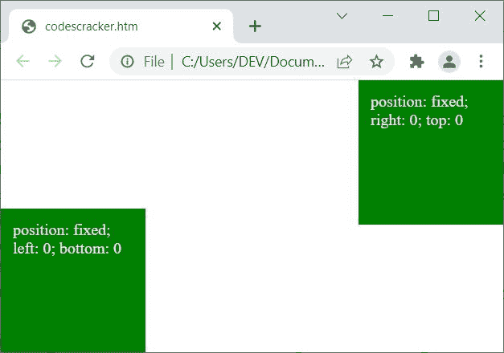
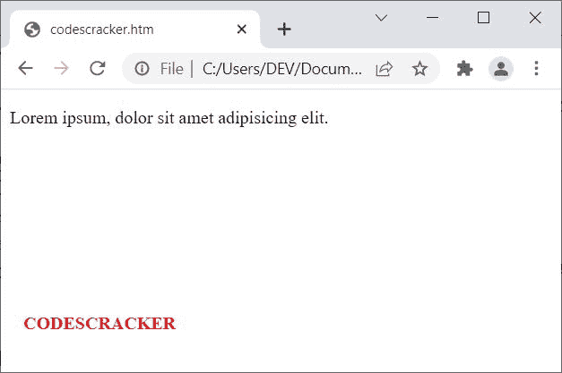

# CSS 位置

> 原文：<https://codescracker.com/css/css-positioning.htm>

CSS **position** 属性用于使用[顶部](/css/css-top.htm)、 、[右侧](/css/css-right.htm)、[底部](/css/css-bottom.htm)和[左侧](/css/css-left.htm)、 属性，基于为其定义的值(**静态**、**相对**、**固定**、**绝对**或**粘性** ) 【T22)来定义元素的位置。例如:

```
<!DOCTYPE html>
<html>
<head>
   <style>
      div{width: 120px; height: 120px; background-color: green;
         color: whitesmoke; padding: 12px;}
      div.a{position: fixed; right: 0; top: 0;}
      div.b{position: fixed; left: 0; bottom: 0;}
   </style>
</head>
<body>

   <div class="a">position: fixed; right: 0; top: 0</div>
   <div class="b">position: fixed; left: 0; bottom: 0</div>

</body>
</html>
```

此示例产生的输出显示在下面给出的快照中:



## CSS 位置语法

CSS 中**位置**属性的语法是:

```
position: x;
```

**x** 的值应该是下列值之一:

*   **静态** -用于让元素正常流动。这是<u>默认的</u>值。**顶部**、 、**右侧**、**底部**和**左侧**属性对**位置为静态**的元素没有影响
*   **fixed** -用来固定一个元素在网页上的位置。相对于当前浏览器的窗口，一个元素的位置将取代
*   **相对** -用于从正常位置移动(定位)一个元素，而不打断 网页上的其他内容
*   **绝对**——类似于**固定**，除了它根据元素的 父位置来固定元素的位置。如果没有定位元素可作为其父元素，那么它将作为**固定**
*   **sticky** -当元素到达其定义的 位置时，用于将元素粘贴到其定义的位置，当然是使用滚动。因此我们可以说，**粘性**定位元件在**相对**和**固定**位置之间切换 。也就是说，最初该元素充当**相对** 定位的元素，但是当该元素获得其定义的位置时，它将坚持该位置
*   **初始** -用来使用默认值
*   **inherit** -用于使用父元素继承的值

## CSS 位置:静态示例

HTML with CSS Code

```
<!DOCTYPE html>
<html>
<head>
   <style>
      span{position: static; color: red; font-weight: bold;}
   </style>
</head>
<body>

   <p>Lorem ipsum, dolor sit amet <span>CODESCRACKER</span> adipisicing elit.</p>

</body>
</html>
```

Output

Lorem ipsum，dolor sit ametCODESCRACKERadipsing elit。

## CSS 位置:固定示例

```
<!DOCTYPE html>
<html>
<head>
   <style>
      span{position: fixed; color: red; font-weight: bold;
         left: 20px; top: 200px;}
   </style>
</head>
<body>

   <p>Lorem ipsum, dolor sit amet <span>CODESCRACKER</span> adipisicing elit.</p>

</body>
</html>
```

上面示例产生的输出显示在下面给出的快照中:



## CSS 位置:相对示例

HTML with CSS Code

```
<!DOCTYPE html>
<html>
<head>
   <style>
      .a{position: relative; top: 10px;}
      .b{position: relative; left: 20px;}
   </style>
</head>
<body>

   <h2>Without position: relative</h2>
   <p>Lorem ipsum <span>CODESCRACKER</span> dolor sit amet.</p>

   <h2>With position: relative; top: 10px</h2>
   <p>Lorem ipsum <span class="a">CODESCRACKER</span> dolor sit amet.</p>

   <h2>With position: relative; left: 20px</h2>
   <p>Lorem ipsum <span class="b">CODESCRACKER</span> dolor sit amet.</p>

</body>
</html>
```

Output

## 无位置:相对

亲爱的朋友，请坐。

## 带位置:相对；顶部:10px

亲爱的朋友，请坐。

## 带位置:相对；左:20px

亲爱的朋友，请坐。

从上面例子可以看出，一个相对定位的元素相对于它的正常位置被定位。

## CSS 位置:绝对示例

HTML with CSS Code

```
<!DOCTYPE html>
<html>
<head>
   <style>
      .a{position: relative; width: 320px; height: 280px;
         border: 2px solid red;}
      .b{position: absolute; top: 120px; right: 10px; padding: 12px;
         border: 2px solid blue;}
   </style>
</head>
<body>

   <div class="a">
      <div class="b">CODESCRACKER</div>
   </div>

</body>
</html>
```

OutputCODESCRACKER

然而，如果绝对定位元素的父元素都不是定位元素，那么**位置:绝对**的行为类似于**位置:固定**。例如:

```
<!DOCTYPE html>
<html>
<head>
   <style>
      .a{width: 320px; height: 280px; border: 2px solid red;}
      .b{position: absolute; top: 120px; right: 10px; padding: 12px;
         border: 2px solid blue;}
   </style>
</head>
<body>

   <div class="a">
      <div class="b">CODESCRACKER</div>
   </div>

</body>
</html>
```

现在输出将是:


## CSS 位置:粘性示例

HTML with CSS Code

```
<!DOCTYPE html>
<html>
<head>
   <style>
      div.a{position: relative; height: 120px; overflow: auto;}
      .s{position: sticky; top: 0; background-color: green;
         color: whitesmoke; text-align: center; padding: 7px;}
   </style>
</head>
<body>

   <div class="a">
      <h4>Scroll to see the sticky positioned element, that will stick to the top</h4>
      <div class="s">CODESCRACKER</div>
      <p>Lorem ipsum dolor sit amet consectetur adipisicing.</p>
      <p>Lorem ipsum dolor sit amet consectetur adipisicing elit. Dignissimos, consectetur
         est. Esse.</p>
      <p>Lorem ipsum dolor sit amet consectetur adipisicing elit. Quas qui eveniet
         incidunt amet, non excepturi impedit exercitationem soluta maxime doloremque.</p>
      <p>Lorem ipsum dolor sit amet consectetur.</p>
      <p>Lorem ipsum, dolor sit amet consectetur adipisicing elit. Debitis, accusamus.</p>
      <p>Lorem ipsum dolor sit amet consectetur adipisicing elit.</p>
      <p>Lorem ipsum dolor sit amet consectetur adipisicing elit. Accusantium.</p>
   </div>

</body>
</html>
```

Output

#### 滚动查看粘性定位元素，它将粘在顶部

CODESCRACKER

这是一个痛苦的决定。

人们认为肥胖是一个问题。东海岸。埃塞。

人们认为肥胖是一个问题。即使是晚上，也不例外。

这是我最喜欢的。

Lorem ipsum，dolor 说他是肥胖精英。借，还。

人们认为肥胖是一个问题。

人们认为肥胖是一个问题。Accusantium。

在上面的例子中，下面的代码:

```
height: 120px; overflow: auto;
```

用于定义使用滚动条溢出内容的 DIV 的高度，只是为了避免为当前屏幕的整个高度写入更多内容。我唯一的目的是，向你展示**粘** 定位元素的例子。

[CSS 在线测试](/exam/showtest.php?subid=5)

* * *

* * *