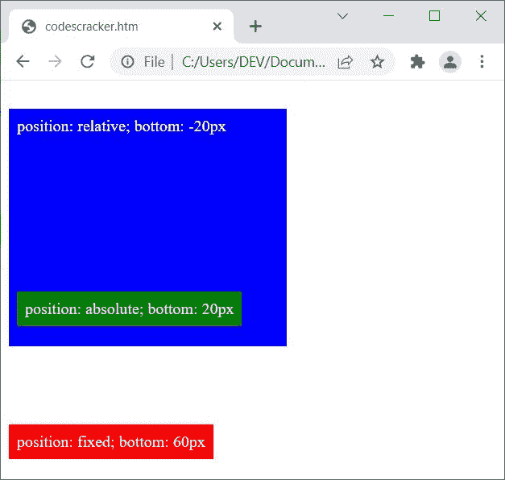

# CSS 底部

> 原文：<https://codescracker.com/css/css-bottom.htm>

CSS **bottom** 属性用于定义一个元素从底边开始的垂直位置。这个 属性只影响被定位的元素。例如:

HTML with CSS Code

```
<!DOCTYPE html>
<html>
<head>
   <style>
      .a{position: relative; width: 220px; height: 120px; border: 2px solid red;}
      .b{position: absolute; bottom: 10px; color: blue;}
   </style>
</head>
<body>

   <div class="a">
      <div class="b">CODESCRACKER</div>
   </div>

</body>
</html>
```

OutputCODESCRACKER

在上例中，借助于 **bottom: 10px** ，元素从底边向上移动了 10px。

**注-**[位置](/css/css-positioning.htm)属性定义了 元素的位置类别。

## CSS 底层语法

CSS 中**底部**属性的语法是:

```
bottom: x;
```

**x** 的值应该是下列值之一:

*   [长度](/css/css-length-units.htm) -用来移动一个元素一些自定义的长度，如 **12px**、 **2cm** 等。从底部边缘
*   **auto** -用于允许浏览器自动定义一个元素的底部位置。这是<u>默认的</u>值
*   **初始** -用来使用默认值
*   **inherit** -用于使用父元素继承的值

## CSS 底部示例

```
<!DOCTYPE html>
<html>
<head>
   <style>
      .a{position: fixed; bottom: 20px; background-color: red;
         color: whitesmoke; padding: 8px;}
      .b{position: relative; width: 260px; height: 220px;
         background-color: blue; color: whitesmoke;
         bottom: -20px; padding: 8px;}
      .c{position: absolute; bottom: 20px; background-color: green;
         color: whitesmoke; padding: 8px;}
   </style>
</head>
<body>

   <div class="a">position: fixed; bottom: 60px</div>
   <div class="b">position: relative; bottom: -20px
      <div class="c">position: absolute; bottom: 20px</div>
   </div>

</body>
</html>
```

上述示例产生的输出是:



**注意-** 给 **bottom** 属性一个负值，会从底边向下移动一个元素。例如:

HTML with CSS Code

```
<!DOCTYPE html>
<html>
<head>
   <style>
      .a{position: relative; width: 260px; height: 120px; padding: 8px;
         background-color: gray; color: whitesmoke;}
      .x{position: absolute; bottom: 40px; background-color: green;
         color: whitesmoke; padding: 8px;}
      .y{position: absolute; bottom: -40px; background-color: blue;
         color: whitesmoke; padding: 8px;}
   </style>
</head>
<body>

   <div class="a">
      <div class="x">position: absolute; bottom: 40px</div>
      <div class="y">position: absolute; bottom: -40px</div>
   </div>

</body>
</html>
```

Outputposition: absolute; bottom: 40pxposition: absolute; bottom: -40px

[CSS 在线测试](/exam/showtest.php?subid=5)

* * *

* * *