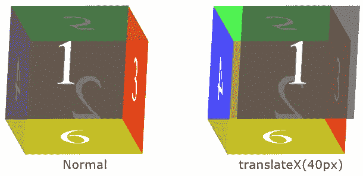

# CSS transform: translateX()

> 原文：<https://codescracker.com/css/css-translatex-function.htm>

CSS **translateX()** 函数用于定义[变换](/css/css-transform.htm) 属性，在 x 轴上左右移动一个元素。下图显示了 x 轴上的 元素是如何平移的:


例如:

HTML with CSS Code

```
<!DOCTYPE html>
<html>
<head>
   <style>
      div{width: 120px; height: 60px; background: peru; margin: auto;}
      .b{transform: translateX(20px);}
      .c{transform: translateX(-20px);}
      .d{transform: translateX(60px);}
      .e{transform: translateX(-60px);}
   </style>
</head>
<body>

   <h2>Without translateX()</h2>
   <div class="a"></div>

   <h2>translateX(20px)</h2>
   <div class="b"></div>

   <h2>translateX(-20px)</h2>
   <div class="c"></div>

   <h2>translateX(60px)</h2>
   <div class="d"></div>

   <h2>translateX(-60px)</h2>
   <div class="e"></div>

</body>
</html>
```

Output

## 不带 translateX()

## translate x(20 像素)

## translateX(-20px)

## translateX(60px)

## translateX(-60px)

## CSS translateX()语法

CSS 中 **translateX()** 函数的语法是:

```
transform: translateX(length)
```

**注-**[CSS 中可以使用的长度单位](/css/css-length-units.htm)，在 单独的教程中有定义。

下图显示了两个 3D 盒子(骰子)。第一个是普通骰子，而我已经将**transform:translate x(40px)**应用到第二个骰子的正面(值为 **1** 的面)。



[CSS 在线测试](/exam/showtest.php?subid=5)

* * *

* * *