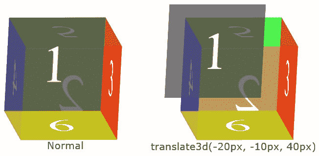

# CSS transform: translate3d()

> 原文：<https://codescracker.com/css/css-translate3d-function.htm>

CSS **translate3d()** 函数用于定义[变换](/css/css-transform.htm) 属性，以一次在 x 轴上左右、y 轴上上下和 z 轴上前后移动一个元素。例如:

HTML with CSS Code

```
<!DOCTYPE html>
<html>
<head>
   <style>
      #t3d {width: 160px; height: 160px; transform-style: preserve-3d;
         transform: rotate3d(12, -7, 1, 20deg); margin: 80px auto;}
      .a, .b, .c, .d {width: 100%; height: 100%; position: absolute;}

      .a {transform: translate3d(0); background: rgba(255, 0, 0, 0.72);}
      .b {transform: translate3d(60px, 0px, 0px); background: rgba(0, 255, 0, 0.72);}
      .c {transform: translate3d(60px, 60px, 0px); background: rgba(0, 0, 255, 0.72);}
      .d {transform: translate3d(60px, 60px, 60px); background: rgba(164, 164, 164, 0.72);}

   </style>
</head>
<body>

   <div id="t3d">
      <div class="a"></div>
      <div class="b"></div>
      <div class="c"></div>
      <div class="d"></div>
   </div>

</body>
</html>
```

Output

在上面的例子中，第一个 DIV(类名为 **a** 或红框的 DIV)在中间，而 剩余的三个 DIV 是这样翻译的:

*   第二个 DIV(绿色框)在 x 轴上向右平移 60px
*   第三个 DIV(蓝框)在 x 轴上向右平移 60px，在 y 轴上向下平移 60px
*   第四个 DIV(灰色框)在 x 轴上向右平移 60px，在 y 轴上向下平移 60px，在 z 轴上向前平移 60px

基本上， **translate3d()** 函数用于一次性定义 [translateX()](/css/css-translatex-function.htm) 、 [translateY()](/css/css-translatey-function.htm) 和 [translateZ()](/css/css-translatez-function.htm) 到元素的转换。例如:



在上例中，第二个模具的正面(值为 **1** 的面)在 x 轴上向左 移动 **20px** ，在 y 轴上向上移动 **10px** ，在 z 轴上向前移动 **40px** 。

**注意-**[transform-style](/css/css-transform-style.htm)属性用于设置 子元素是否位于 3D 空间。

**注意-**[rotate 3d()](/css/css-rotate3d-function.htm)函数沿着 x 轴、y 轴和 z 轴旋转一个元素，一次旋转一个特定的角度。

## CSS translate3d()语法

CSS 中 **translate3d()** 函数的语法是:

```
transform: translate3d(x, y, z);
```

或者

```
transform: translate3d(translateX(), translateY(), translateZ());
```

**注意-** 我们可以使用任何有效的[长度单位](/css/css-length-units.htm)来定义 **translate3d()** 函数的所有三个 参数。

[CSS 在线测试](/exam/showtest.php?subid=5)

* * *

* * *