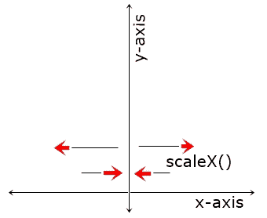

# CSS 转换:scaleX()

> 原文：<https://codescracker.com/css/css-scalex-function.htm>

CSS **scaleX()** 函数用于定义[变换](/css/css-transform.htm) 属性，对 x 轴上的元素进行缩放(拉伸/收缩或调整大小)，方法如下:



例如:

HTML with CSS Code

```
<!DOCTYPE html>
<html>
<head>
   <style>
      div{width: 60px; height: 60px; background: peru; margin: auto;}
      div.b{transform: scaleX(0.2);}
      div.c{transform: scaleX(0.6);}
      div.d{transform: scaleX(1);}
      div.e{transform: scaleX(1.2);}
      div.f{transform: scaleX(2.8);}
   </style>
</head>
<body>

   <h2>Without scaleX()</h2>
   <div class="a"></div>

   <h2>scaleX(0.2)</h2>
   <div class="b"></div>

   <h2>scaleX(0.6)</h2>
   <div class="c"></div>

   <h2>scaleX(1)</h2>
   <div class="d"></div>

   <h2>scaleX(1.2)</h2>
   <div class="e"></div>

   <h2>scaleX(2.8)</h2>
   <div class="f"></div>

</body>
</html>
```

Output

## 不带 scaleX()

## scaleX(0.2)

## scaleX(0.6)

## scaleX(1)

## scaleX(1.2)

## scaleX(2.8)

根据给 **scaleX()** 函数的值， **DIV** 的大小在 x 轴上增加/减少。 **scaleX(1)**用于原来的那个。

**注意** -元素被缩放而不会中断网页上的任何其他元素。

## CSS scaleX()语法

CSS 中 **scaleX()** 函数的语法是:

```
transform: scaleX(val);
```

**val** 的值可以是正数、零或负数。

[CSS 在线测试](/exam/showtest.php?subid=5)

* * *

* * *