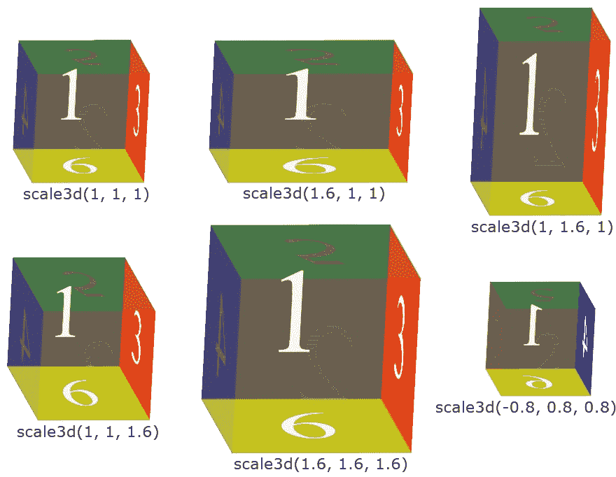

# CSS 转换:scale3d()

> 原文：<https://codescracker.com/css/css-scale3d-function.htm>

CSS **scale3d()** 函数用于定义[变换](/css/css-transform.htm) 属性，以一次缩放(调整大小/收缩或调整大小)x、y 和 z 轴上的元素，方法如下:



例如:

HTML with CSS Code

```
<!DOCTYPE html>
<html>
<head>
   <style>
      div{width: 120px; height: 60px; background: peru; margin: auto;}
      .b{transform: perspective(400px) scale3d(1, 1, 1) rotateX(45deg);}
      .c{transform: perspective(400px) scale3d(1, 1, 4) rotateX(45deg);}
      .d{transform: perspective(400px) scale3d(1, 1, 8) rotateX(45deg);}
      .e{transform: perspective(400px) scale3d(2, 1, 8) rotateX(45deg);}
      .f{transform: perspective(400px) scale3d(1, 3, 5) rotateX(45deg);}
      .g{transform: perspective(400px) scale3d(0.5, 1, 5) rotateX(45deg);}
      .h{transform: perspective(400px) scale3d(1, 0.5, 5) rotateX(45deg);}
   </style>
</head>
<body>

   <h2>Without scale3d()</h2>
   <div class="a"></div>

   <h2>scale3d(1, 1, 1)</h2>
   <div class="b"></div>

   <h2>scale3d(1, 1, 4)</h2>
   <div class="c"></div>

   <h2>scale3d(1, 1, 8)</h2>
   <div class="d"></div>

   <h2>scale3d(2, 1, 8)</h2>
   <div class="e"></div>

   <h2>scale3d(1, 3, 5)</h2>
   <div class="f"></div>

   <h2>scale3d(0.5, 1, 5)</h2>
   <div class="g"></div>

   <h2>scale3d(1, 0.5, 5)</h2>
   <div class="h"></div>

</body>
</html>
```

Output

## 不带 scale3d()

## scale3d(1，1，1)

## scale3d(1，1，4)

## scale3d(1，1，8)

## scale3d(2，1，8)

## scale3d(1，3，5)

## scale3d(0.5，1，5)

## scale3d(1，0.5，5)

在上面的例子中，我使用了 [perspective()](/css/css-perspective-function.htm) 和 [【rotateX()](/css/css-rotatex-function.htm)，这样效果上的变化可以很容易地被发现， 因为我们看不到元素在平面表面上 **z 轴**上的变换。

**注意-****rotateX()**函数沿 x 轴旋转一个元素。

**注意-****perspective()**功能从 z=0 平面向前或向后放置视图。

## CSS scale3d()语法

CSS 中 **scale3d()** 函数的语法是:

```
transform: scale3d(x, y, z);
```

**x** 、 **y** 、 **z** 轴的值可以是正数、零或负数。 **scale3d()** 的一般 形式也可以写成:

```
transform: scale3d(scaleX(), scaleY(), scaleZ());
```

[CSS 在线测试](/exam/showtest.php?subid=5)

* * *

* * *