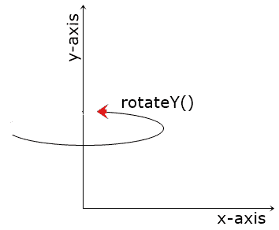

# CSS 转换:rotateY()

> 原文：<https://codescracker.com/css/css-rotatey-function.htm>

CSS **rotateY()** 函数用于定义[变换](/css/css-transform.htm) 属性，沿 y 轴旋转一个元素，这样:



例如:

HTML with CSS Code

```
<!DOCTYPE html>
<html>
<head>
   <style>
      div{width: 120px; height: 60px; background: peru; margin: auto;}
      .b{transform: rotateY(12deg);}
      .c{transform: rotateY(25deg);}
      .d{transform: rotateY(45deg);}
      .e{transform: rotateY(80deg);}
      .f{transform: rotateY(90deg);}
      .g{transform: rotateY(135deg);}
      .h{transform: rotateY(180deg);}
   </style>
</head>
<body>

   <h2>Without rotateY()</h2>
   <div class="a"></div>

   <h2>rotateY(12deg)</h2>
   <div class="b"></div>

   <h2>rotateY(25deg)</h2>
   <div class="c"></div>

   <h2>rotateY(45deg)</h2>
   <div class="d"></div>

   <h2>rotateY(80deg)</h2>
   <div class="e"></div>

   <h2>rotateY(90deg)</h2>
   <div class="f"></div>

   <h2>rotateY(135deg)</h2>
   <div class="g"></div>

   <h2>rotateY(180deg)</h2>
   <div class="h"></div>

</body>
</html>
```

Output

## 无旋转()

## rotateY(12deg)

## rotateY(25deg)

## rotateY(45deg)

## rotateY(80deg)

## rotateY(90deg)

## rotateY(135deg)

## rotateY(180deg)

## CSS rotateY()语法

CSS 中 **rotateY()** 函数的语法是:

```
transform: rotateY(degree);
```

**度**参数的值将是以下任何一个:

*   **deg**——代表度数。一整圈等于 360 度。例如:20 度、132 度等。
*   grad 代表 gradians。一整圈等于 400 格。例如:12grad、324grad 等。
*   **rad** -代表弧度。一整圈等于 6.2832 拉德。例如:0.32 拉德，3.43 拉德等。
*   **转弯** -代表转弯。一整圈等于 1 圈。例如:0.1 转，0.46 转

[CSS 在线测试](/exam/showtest.php?subid=5)

* * *

* * *