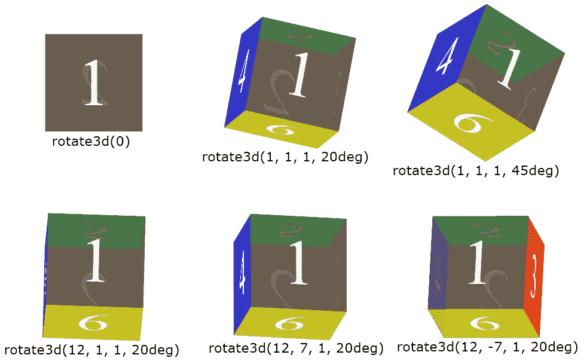

# CSS 转换:rotate3d()

> 原文：<https://codescracker.com/css/css-rotate3d-function.htm>

CSS **rotate3d()** 函数用于定义[变换](/css/css-transform.htm) 属性，将元素沿 x、y、z 轴旋转给定的角度。例如:

HTML with CSS Code

```
<!DOCTYPE html>
<html>
<head>
   <style>
      div{width: 120px; height: 60px; background: peru; margin: auto;}
      .b{transform: rotate3d(1, 1, 1, 25deg);}
      .c{transform: rotate3d(1, 1, 1, 60deg);}
      .d{transform: rotate3d(2, 1, 1, 60deg);}
      .e{transform: rotate3d(1, 2, 1, 60deg);}
      .f{transform: rotate3d(1, 1, 2, 60deg);}
      .g{transform: rotate3d(3, 5, 2, 90deg);}
   </style>
</head>
<body>

   <h2>Without rotate3d()</h2>
   <div class="a"></div>

   <h2>rotate3d(1, 1, 1, 25deg)</h2>
   <div class="b"></div>

   <h2>rotate3d(1, 1, 1, 60deg)</h2>
   <div class="c"></div>

   <h2>rotate3d(2, 1, 1, 60deg)</h2>
   <div class="d"></div>

   <h2>rotate3d(1, 2, 1, 60deg)</h2>
   <div class="e"></div>

   <h2>rotate3d(1, 1, 2, 60deg)</h2>
   <div class="f"></div>

   <h2>rotate3d(3, 5, 2, 90deg)</h2>
   <div class="g"></div>

</body>
</html>
```

Output

## 不带旋转 3d()

## rotate3d(1, 1, 1, 25deg)

## rotate3d(1, 1, 1, 60deg)

## rotate3d(2, 1, 1, 60deg)

## rotate3d(1, 2, 1, 60deg)

## rotate3d(1, 1, 2, 60deg)

## rotate3d(3, 5, 2, 90deg)

基本上， **rotate3d()** 函数用于定义 3d 旋转，如下所示:



## CSS rotate3d()语法

CSS 中 **rotate3d()** 函数的语法是:

```
transform: rotate3d(x, y, z, degree);
```

**x** 、 **y** 和 **z** 的值将是正数、零或负数。鉴于**度**的 值将为以下任意值:

*   **deg**——代表度数。一整圈等于 360 度
*   grad 代表 gradians。一整圈等于 400 格
*   **rad** -代表弧度。一整圈等于 6.2832 拉德
*   **转弯** -代表转弯。一整圈等于 1 圈

因此， **rotate3d()** 函数用于一次应用 **rotateX()** 、 **rotateY()** 、 **rotateZ()** ，并指定度数。因此，**的一般形式 rotate3d()** ，也可以将 写成:

```
transform: rotate3d(rotateX(), rotateY(), rotateZ(), degree);
```

[CSS 在线测试](/exam/showtest.php?subid=5)

* * *

* * *