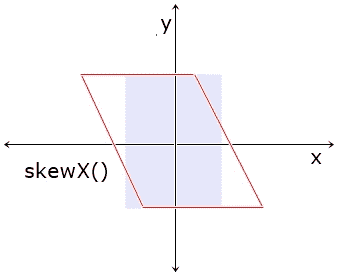

# CSS 转换:skewX()

> 原文：<https://codescracker.com/css/css-skewx-function.htm>

CSS **skewX()** 函数用于定义[变换](/css/css-transform.htm)属性 来水平倾斜一个元素(在 x 轴上)。在 x 轴上倾斜一个元素，意味着该元素既不会与 x 轴 平行，也不会与 x 轴相交，它将像一个斜面，如下面的快照所示:



例如:

HTML with CSS Code

```
<!DOCTYPE html>
<html>
<head>
   <style>
      div{width: 120px; height: 60px; background: peru; margin: auto;}
      .b{transform: skewX(20deg);}
      .c{transform: skewX(45deg);}
      .d{transform: skewX(80deg);}
      .e{transform: skewX(90deg);}
      .f{transform: skewX(100deg);}
      .g{transform: skewX(135deg);}
      .h{transform: skewX(0deg);}
      .i{transform: skewX(-45deg);}
   </style>
</head>
<body>

   <h2>Without skewX()</h2>
   <div class="a"></div>

   <h2>skewX(20deg)</h2>
   <div class="b"></div>

   <h2>skewX(45deg)</h2>
   <div class="c"></div>

   <h2>skewX(80deg)</h2>
   <div class="d"></div>

   <h2>skewX(90deg)</h2>
   <div class="e"></div>

   <h2>skewX(100deg)</h2>
   <div class="f"></div>

   <h2>skewX(135deg)</h2>
   <div class="g"></div>

   <h2>skewX(0deg)</h2>
   <div class="h"></div>

   <h2>skewX(-45deg)</h2>
   <div class="i"></div>

</body>
</html>
```

Output

## 不带 skewX()

## skewX(20deg)

## skewX(45deg)

## skewX(80deg)

## skewX(90deg)

## skewX(100deg)

## skewX(135deg)

## skewX(0deg)

## skewX(-45deg)

## CSS skewX()语法

CSS 中 **skewX()** 函数的语法是:

```
transform: skewX(val);
```

**val** 参数的值将是以下任何一个:

*   **deg**——代表度数。一整圈等于 360 度
*   grad 代表 gradians。一整圈等于 400 格
*   **rad** -代表弧度。一整圈等于 6.2832 拉德
*   **转弯** -代表转弯。一整圈等于 1 圈

[CSS 在线测试](/exam/showtest.php?subid=5)

* * *

* * *