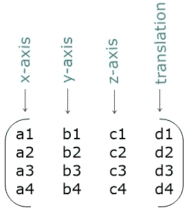

# CSS 转换:matrix3d()

> 原文：<https://codescracker.com/css/css-matrix3d-function.htm>

CSS **matrix3d()** 函数用于定义[变换](/css/css-transform.htm) 属性，将 3d 变换作为 4x4 同质矩阵应用于元素。例如:

HTML with CSS Code

```
<!DOCTYPE html>
<html>
<head>
   <style>
      div{width: 120px; height: 60px; background: peru; margin: auto;}
      .mat{transform: matrix3d(1, 0, 0, 0.008, 0, 1, 0, 0.008, 0, 0, 1, 0, 0, 0, 0, 1);}
   </style>
</head>
<body>

   <h2>Without matrix3d()</h2>
   <div class="normal"></div>

   <h2>matrix3d(1, 0, 0, 0.008, 0, 1, 0, 0.008, 0, 0, 1, 0, 0, 0, 0, 1)</h2>
   <div class="mat"></div>

</body>
</html>
```

Output

## 不带 matrix3d()

## matrix3d(1，0，0，0.008，0，1，0，0.008，0，0，1，0，0，0，0，1)

基本上， **matrix3d()** 函数用于对一个元素进行单次或多次转换。 也就是说，使用这个函数，我们可以一次应用多个转换函数。

## CSS matrix3d()语法

CSS 中 **matrix3d()** 函数的语法是:

```
transform: matrix3d(a1, b1, c1, d1, a2, b2, c2, d2, a3, b3, c3, d3, a4, b4, c4, d4);
```

有 16 个参数或值，按列主顺序排列。因此，作为矩阵元素的参数将是:



前 12 个值用于定义线性变换。而最后 4 个值用于应用转换。

**注-** 我们可以用正数、零或负数来定义这 16 个值。

在上面通用形式的 **matrix3d()** 函数中，下面是用于应用变换 函数的参数列表:

*   **a1** 指 [scaleX()](/css/css-scalex-function.htm)
*   **b1** 指 [skewY()](/css/css-skewy-function.htm)
*   **a2** 指 [skewX()](/css/css-skewx-function.htm)
*   **b2** 指 [scaleY()](/css/css-scaley-function.htm)
*   **c3** 指 [scaleZ()](/css/css-scalez-function.htm)
*   **a4** 指 [translateX()](/css/css-translatex-function.htm)
*   **b4** 指 [translateY()](/css/css-translatey-function.htm)
*   **c4** 指 [translateZ()](/css/css-translatez-function.htm)

其余的参数是 c1、d1、c2、d2、a3、b3、d3 和 d4，它们将在下面的三个示例中演示。第一个示例演示 d1 和 d2，第二个示例演示 d4，第三个示例逐个演示 c1、c2、a3、b3 和 d3 参数。

## CSS matrix3d()示例 1

HTML with CSS Code

```
<!DOCTYPE html>
<html>
<head>
   <style>
      div{width: 120px; height: 60px; background: peru; margin: auto;}
      .a{transform: matrix3d(1, 0, 0, 0, 0, 1, 0, 0, 0, 0, 1, 0, 0, 0, 0, 1);}
      .b{transform: matrix3d(1, 0, 0, 0.01, 0, 1, 0, 0, 0, 0, 1, 0, 0, 0, 0, 1);}
      .c{transform: matrix3d(1, 0, 0, -0.01, 0, 1, 0, 0, 0, 0, 1, 0, 0, 0, 0, 1);}
      .d{transform: matrix3d(1, 0, 0, 0, 0, 1, 0, 0.01, 0, 0, 1, 0, 0, 0, 0, 1);}
      .e{transform: matrix3d(1, 0, 0, 0, 0, 1, 0, -0.01, 0, 0, 1, 0, 0, 0, 0, 1);}
   </style>
</head>
<body>

   <h2>matrix3d(1, 0, 0, 0, 0, 1, 0, 0, 0, 0, 1, 0, 0, 0, 0, 1)</h2>
   <div class="a"></div>

   <h2>matrix3d(1, 0, 0, 0.01, 0, 1, 0, 0, 0, 0, 1, 0, 0, 0, 0, 1)</h2>
   <div class="b"></div>

   <h2>matrix3d(1, 0, 0, -0.01, 0, 1, 0, 0, 0, 0, 1, 0, 0, 0, 0, 1)</h2>
   <div class="c"></div>

   <h2>matrix3d(1, 0, 0, 0, 0, 1, 0, 0.01, 0, 0, 1, 0, 0, 0, 0, 1)</h2>
   <div class="d"></div>

   <h2>matrix3d(1, 0, 0, 0, 0, 1, 0, -0.01, 0, 0, 1, 0, 0, 0, 0, 1)</h2>
   <div class="e"></div>

</body>
</html>
```

Output

## matrix3d(1，0，0，0，0，0，1，0，0，0，0，0，1，0，0，0，0，1)

## matrix3d(1，0，0，0.01，0，1，0，0，0，0，1，0，0，0，0，0，0，1)

## matrix3d(1，0，0，-0.01，0，1，0，0，0，0，1，0，0，0，0，0，0，0，1)

## matrix3d(1，0，0，0，0，0，1，0，0.01，0，0，1，0，0，0，0，0，1)

## matrix3d(1，0，0，0，0，0，1，0，-0.01，0，0，1，0，0，0，0，0，1)

## CSS matrix3d()示例 2

HTML with CSS Code

```
<!DOCTYPE html>
<html>
<head>
   <style>
      div{width: 120px; height: 60px; background: peru; margin: auto;}
      .a{transform: perspective(400px) matrix3d(1, 0, 0, 0, 0, 1, 0, 0, 0, 0, 1, 0, 0, 0, 0, 1);}
      .b{transform: perspective(400px) matrix3d(1, 0, 0, 0, 0, 1, 0, 0, 0, 0, 1, 0, 0, 0, 0, 1.1);}
      .c{transform: perspective(400px) matrix3d(1, 0, 0, 0, 0, 1, 0, 0, 0, 0, 1, 0, 0, 0, 0, 2.3);}
      .d{transform: perspective(400px) matrix3d(1, 0, 0, 0, 0, 1, 0, 0, 0, 0, 1, 0, 0, 0, 0, 0.6);}
   </style>
</head>
<body>

   <h2>matrix3d(1, 0, 0, 0, 0, 1, 0, 0, 0, 0, 1, 0, 0, 0, 0, 1)</h2>
   <div class="a"></div>

   <h2>matrix3d(1, 0, 0, 0, 0, 1, 0, 0, 0, 0, 1, 0, 0, 0, 0, 1.1)</h2>
   <div class="b"></div>

   <h2>matrix3d(1, 0, 0, 0, 0, 1, 0, 0, 0, 0, 1, 0, 0, 0, 0, 2.3)</h2>
   <div class="c"></div>

   <h2>matrix3d(1, 0, 0, 0, 0, 1, 0, 0, 0, 0, 1, 0, 0, 0, 0, 0.6)</h2>
   <div class="d"></div>

</body>
</html>
```

Output

## matrix3d(1，0，0，0，0，0，1，0，0，0，0，0，1，0，0，0，0，1)

## matrix3d(1，0，0，0，0，0，1，0，0，0，0，0，1，0，0，0，0，0，1.1)

## matrix3d(1，0，0，0，0，0，1，0，0，0，0，0，1，0，0，0，0，0，2.3)

## matrix3d(1，0，0，0，0，1，0，0，0，0，0，1，0，0，0，0，0，0.6)

[perspective()](/css/css-perspective-function.htm) 功能用于设置用户与 z=0 平面之间的距离 。由于像 z 轴上的一些变换，在 2D 平面上是看不到的， 因此我们需要从 z=0 平面的前面或后面放置视图，就像在上面的例子 中使用**透视()**所做的那样。

## CSS matrix3d()示例 3

HTML with CSS Code

```
<!DOCTYPE html>
<html>
<head>
   <style>
      div{width: 120px; height: 60px; background: peru; margin: auto;}
      .a{transform: matrix3d(1, 0, 0, 0, 0, 1, 0, 0, 0, 0, 1, 0, 0, 0, 0, 1);}
      .b{transform: perspective(400px) matrix3d(1, 0, 1, 0, 0, 1, 0, 0, 0, 0, 1, 0, 0, 0, 0, 1) rotateY(-45deg);}
      .c{transform: perspective(400px) matrix3d(1, 0, 4, 0, 0, 1, 0, 0, 0, 0, 1, 0, 0, 0, 0, 1) rotateY(-45deg);}
      .d{transform: perspective(400px) matrix3d(1, 0, 0, 0, 0, 1, 1, 0, 0, 0, 1, 0, 0, 0, 0, 1) rotateY(-45deg);}
      .e{transform: perspective(400px) matrix3d(1, 0, 0, 0, 0, 1, 4, 0, 0, 0, 1, 0, 0, 0, 0, 1) rotateY(-45deg);}
      .f{transform: perspective(400px) matrix3d(1, 0, 0, 0, 0, 1, 0, 0, 1, 0, 1, 0, 0, 0, 0, 1) rotateY(-45deg);}
      .g{transform: perspective(400px) matrix3d(1, 0, 0, 0, 0, 1, 0, 0, 3, 0, 1, 0, 0, 0, 0, 1) rotateY(-45deg);}
      .h{transform: perspective(400px) matrix3d(1, 0, 0, 0, 0, 1, 0, 0, 0, 0.4, 1, 0, 0, 0, 0, 1) rotateY(-45deg);}
      .i{transform: perspective(400px) matrix3d(1, 0, 0, 0, 0, 1, 0, 0, 0, 1.2, 1, 0, 0, 0, 0, 1) rotateY(-45deg);}
      .j{transform: perspective(400px) matrix3d(1, 0, 0, 0, 0, 1, 0, 0, 0, 0, 1, 0.014, 0, 0, 0, 1) rotateY(-45deg);}
      .k{transform: perspective(400px) matrix3d(1, 0, 0, 0, 0, 1, 0, 0, 0, 0, 1, 0.02, 0, 0, 0, 1) rotateY(-45deg);}
   </style>
</head>
<body>

   <h2>matrix3d(1, 0, 0, 0, 0, 1, 0, 0, 0, 0, 1, 0, 0, 0, 0, 1)</h2>
   <div class="a"></div>

   <h2>matrix3d(1, 0, 1, 0, 0, 1, 0, 0, 0, 0, 1, 0, 0, 0, 0, 1)</h2>
   <div class="b"></div>

   <h2>matrix3d(1, 0, 4, 0, 0, 1, 0, 0, 0, 0, 1, 0, 0, 0, 0, 1)</h2>
   <div class="c"></div>

   <h2>matrix3d(1, 0, 0, 0, 0, 1, 1, 0, 0, 0, 1, 0, 0, 0, 0, 1)</h2>
   <div class="d"></div>

   <h2>matrix3d(1, 0, 0, 0, 0, 1, 4, 0, 0, 0, 1, 0, 0, 0, 0, 1)</h2>
   <div class="e"></div>

   <h2>matrix3d(1, 0, 0, 0, 0, 1, 0, 0, 1, 0, 1, 0, 0, 0, 0, 1)</h2>
   <div class="f"></div>

   <h2>matrix3d(1, 0, 0, 0, 0, 1, 0, 0, 3, 0, 1, 0, 0, 0, 0, 1)</h2>
   <div class="g"></div>

   <h2>matrix3d(1, 0, 0, 0, 0, 1, 0, 0, 0, 0.4, 1, 0, 0, 0, 0, 1)</h2>
   <div class="h"></div>

   <h2>matrix3d(1, 0, 0, 0, 0, 1, 0, 0, 0, 1.2, 1, 0, 0, 0, 0, 1)</h2>
   <div class="i"></div>

   <h2>matrix3d(1, 0, 0, 0, 0, 1, 0, 0, 0, 0, 1, 0.014, 0, 0, 0, 1)</h2>
   <div class="j"></div>

   <h2>matrix3d(1, 0, 0, 0, 0, 1, 0, 0, 0, 0, 1, 0.02, 0, 0, 0, 1)</h2>
   <div class="k"></div>

</body>
</html>
```

Output

## matrix3d(1，0，0，0，0，0，1，0，0，0，0，0，1，0，0，0，0，1)

## matrix3d(1，0，1，0，0，1，0，0，0，0，0，1，0，0，0，0，0，1)

## matrix3d(1，0，4，0，0，1，0，0，0，0，0，1，0，0，0，0，0，1)

## matrix3d(1，0，0，0，0，1，1，0，0，0，0，1，0，0，0，0，1)

## matrix3d(1，0，0，0，0，1，4，0，0，0，0，1，0，0，0，0，1)

## matrix3d(1，0，0，0，0，0，1，0，0，1，0，1，0，0，0，0，0，1)

## matrix3d(1，0，0，0，0，0，1，0，0，3，0，1，0，0，0，0，0，1)

## matrix3d(1，0，0，0，0，1，0，0，0，0.4，1，0，0，0，0，0，1)

## matrix3d(1，0，0，0，0，1，0，0，0，1.2，1，0，0，0，0，0，1)

## matrix3d(1，0，0，0，0，1，0，0，0，0，0，1，0.014，0，0，0，0，1)

## matrix3d(1，0，0，0，0，0，1，0，0，0，0，0，1，0.02，0，0，0，1)

**注意-**[rotateY()](/css/css-rotatey-function.htm)函数用于沿 y 轴旋转元素 。这个函数和 **perspective()** 一起被用在上面的例子中，所以转换 很容易被发现，就像主要使用 **matrix3d()** 一样。

您可以使用 **matrix3d()** 函数来应用任何类型的转换，使用多个参数值。

[CSS 在线测试](/exam/showtest.php?subid=5)

* * *

* * *