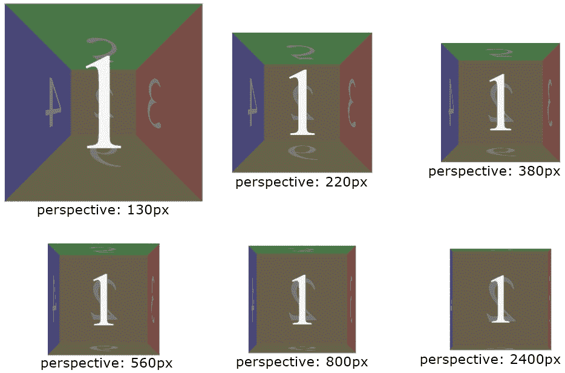
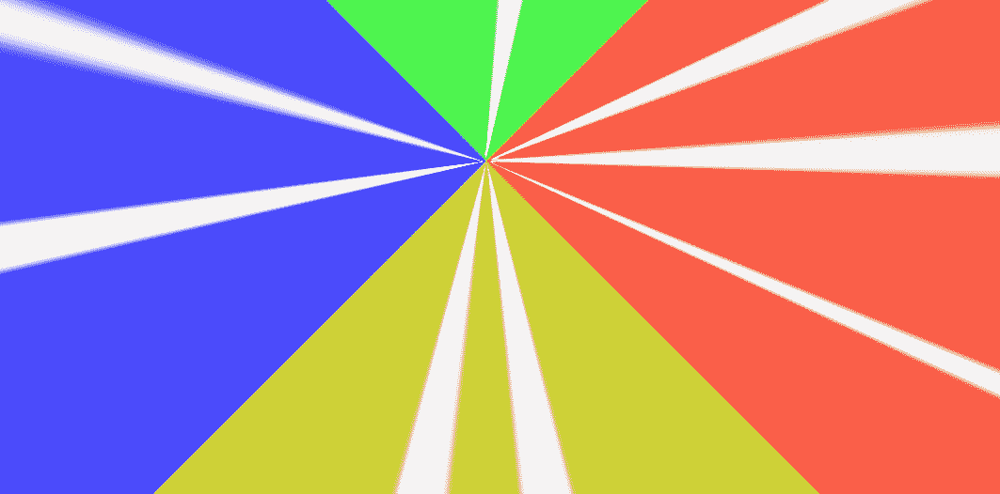

# CSS 透视属性

> 原文：<https://codescracker.com/css/css-perspective-property.htm>

CSS **perspective** 属性用于定义用户与 z=0 平面(网页的 电脑屏幕)之间的距离。例如，下图显示了具有不同 视角的同一个 3D 盒子(模具):



现在一个有趣的问题是，如果我们把透视设为 0 呢？
在这种情况下，由于用户与平面(z=0)之间的距离 变为 0，因此，相同的 3D 框看起来像:



现在，我们可以说，较低的透视值为元素/对象提供了更多的 3D 视角。让我们创建一个 CSS **透视图**属性的例子:

HTML with CSS Code

```
<!DOCTYPE html>
<html>
<head>
   <style>
      .a{perspective: none;}
      .b{perspective: 160px;}
      .c{perspective: 280px;}
      .d{perspective: 800px;}
      .a1, .b1, .c1, .d1 {height: 80px; width: 80px; border: 1px solid;
         background: crimson; transform: rotateX(25deg); margin-left: 74px;}
</style>
</head>
<body>

   <h2>perspective: none</h2>
   <div class="a">
      <div class="a1"></div>
   </div>

   <h2>perspective: 160px</h2>
   <div class="b">
      <div class="b1"></div>
   </div>

   <h2>perspective: 280px</h2>
   <div class="c">
      <div class="c1"></div>
   </div>

   <h2>perspective: 800px</h2>
   <div class="d">
      <div class="d1"></div>
   </div>

</body>
</html>
```

Output

## 视角:无

## 视角:160 像素

## 视角:280 像素

## 视角:800 像素

**注意-** 在一些像 z 轴上的变换中，在 2D 平面上看不到效果，因此我们需要 从 z=0 平面的前面或后面放置视图，当然使用**透视**属性。

**注意-**[rotateX()](/css/css-rotatex-function.htm)函数沿 x 轴旋转一个元素。

## CSS 透视属性语法

CSS 中**透视图**属性的语法是:

```
perspective: value;
```

**值**可以是以下任意值:

*   **无** -用于不设置视角。这是默认值，同**视角:0**
*   [长度](/css/css-length-units.htm) -用于定义自定义视角
*   **初始** -用来使用默认值
*   **inherit** -用于使用父元素继承的值

**注-****视角**属性的工作与[视角()函数](/css/css-perspective-function.htm)类似。 唯一不同的是，perspective 属性应用于一个元素，将透视图设置为它的<u>子元素 的</u>。而 perspective()函数用于设置<u>父元素</u> 本身的透视图。

[CSS 在线测试](/exam/showtest.php?subid=5)

* * *

* * *