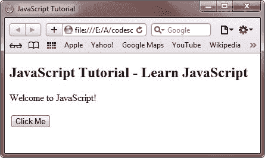

# JavaScript 教程

> 原文：<https://codescracker.com/js/index.htm>

在本教程中，您将从基础到高级学习所有关于 JavaScript 的知识。

## JavaScript 是什么？

JavaScript 是一种客户端和服务器端基于对象的脚本语言，用于制作交互式网页。脚本语言是一种不太复杂的轻量级编程语言。

JavaScript 是最常用的脚本语言，用于为网页增加动态性和交互性。这是因为在客户端编写的 JavaScript 在客户端浏览器上执行，从而减少了服务器的负载。

## JavaScript 是一种解释型语言

JavaScript 是一种解释型语言，这意味着用 JavaScript 编写的脚本是逐行处理的。这些脚本由 JavaScript 解释器解释，JavaScript 解释器是 Web 浏览器的内置组件。

JavaScript 既可以在客户端编写，也可以在服务器端编写。客户端 JavaScript 允许您只验证那些在客户端机器上执行并产生结果的程序。相反，服务器端 JavaScript 只验证那些在服务器上执行的程序。JavaScript 包括各种内置的[对象](/js/js-objects.htm)和特性，可以用来使你的 [HTML](/html/index.htm) 页面动态化。

## JavaScript 是独立于平台的

JavaScript 是平台无关的，这意味着您只需编写一次脚本，就可以在任何平台或浏览器上运行，而不会影响脚本的输出。

## 为什么要学习 JavaScript？

有三种语言，所有 web 开发人员都必须知道，它们是:

*   [HTML](/html/index.htm) -定义网页的内容
*   [CSS](/css/index.htm) -定义网页的布局
*   JavaScript -为网页的行为编程

因此，要设计网页的行为，你必须学习 JavaScript。在本教程中，您将了解 JavaScript 的所有知识。

## JavaScript 的优势

JavaScript 的优势如下:

*   减少服务器交互
*   更多互动
*   更丰富的界面
*   对访问者的快速反馈
*   还有更多

下面是一个简单的 JavaScript 示例。

```
<!DOCTYPE HTML>
<html>
<head>
   <title>JavaScript Tutorial</title>
</head>
<body>

<h2>JavaScript Tutorial - Learn JavaScript</h2>
<p id="test">This is a simple Example of JavaScript.</p>

<button type="button"
onclick="document.getElementById('test').innerHTML = 'Welcome to JavaScript!'">
Click Me</button>

</body>
</html>
```

用**保存上述文件。html 的**扩展名类似于 filename.html 的**，在你的浏览器中打开它，网页会是这样的:**

**

现在点击按钮**点击我**，你会看到**欢迎使用 JavaScript！**在**的地方，这是一个简单的例子 JavaScript。**如下图所示:



您也可以点击下面的按钮，用您自己的手机试试:

## JavaScript 教程-学习 JavaScript

这是 JavaScript 的一个简单例子。

<button type="button" onclick="document.getElementById('test').innerHTML = 'Welcome to JavaScript!'">Click Me</button>

在本系列教程中，您将一个接一个地学习 JavaScript。

## 观众

本教程是为那些 JavaScript 爱好者设计和开发的，他们是这个领域的初学者，希望获得一些从基础到高级的知识，因为我们在本 JavaScript 教程系列的每一章中都包含了尽可能多的代码。

因此，您可以很容易地通过这个 JavaScript 教程系列来获得 JavaScript 知识。

## 先决条件

在开始学习 JavaScript 之前，你必须先了解一些关于[HTML](/html/index.htm)T2 的知识，因为 JavaScript 是一种用来触发 HTML 元素执行一些基于用户的动作的语言。

如果你有一些关于 HTML 和如何编程的知识，那么在这里学习 JavaScript 就变得非常容易。

[JavaScript 在线测试](/exam/showtest.php?subid=6)

* * *

* * ***