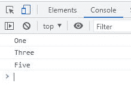
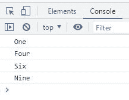

# JavaScript 注释

> 原文：<https://codescracker.com/js/js-comments.htm>

**评论**一词指对任何事物的书面评论或意见。在计算机编程的 世界里，一个*注释*是放在程序里的一段文字，帮助其他程序员理解 程序。

执行程序时，注释被忽略。因此，在调试代码时，注释通常很有帮助。

您可以将注释用于多种目的。例如，使用注释可以:

*   解释一些代码块
*   解释特定语句
*   避免执行某些语句或代码块
*   调试代码
*   等等。

## JavaScript 中的注释类型

JavaScript 允许两种类型的注释。它们是:

1.  单行注释
2.  多行注释

## JavaScript 中的单行注释

JavaScript 中的单行注释，以 **//** 开头。也就是说，任何写在同一行的**//**/ 之后的内容，都将被视为注释。例如:

HTML with JavaScript Code

```
<!DOCTYPE html>
<html>
<body>

   <script>
      console.log("One");
      // console.log("Two");
      console.log("Three"); // console.log("Four");
      console.log("Five");
   </script>

</body>
</html>
```

下面给出的快照显示了上面注释的 JavaScript 示例产生的示例输出:



## JavaScript 中的多行注释

JavaScript 中的多行注释，以 **/*** 开头，以 ***/** 结尾。也就是说， /*和 ***/** 之间的任何内容都将被视为注释。例如:

HTML with JavaScript Code

```
<!DOCTYPE html>
<html>
<body>

   <script>
      console.log("One");
      /*
      console.log("Two");
      console.log("Three");
      */
      console.log("Four"); /* console.log("Five"); */
      console.log("Six"); /* console.log("Seven");
      console.log("Eight"); */
      console.log("Nine");
   </script>

</body>
</html>
```

此示例产生的输出是:



[JavaScript 在线测试](/exam/showtest.php?subid=6)

* * *

* * *