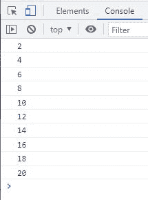
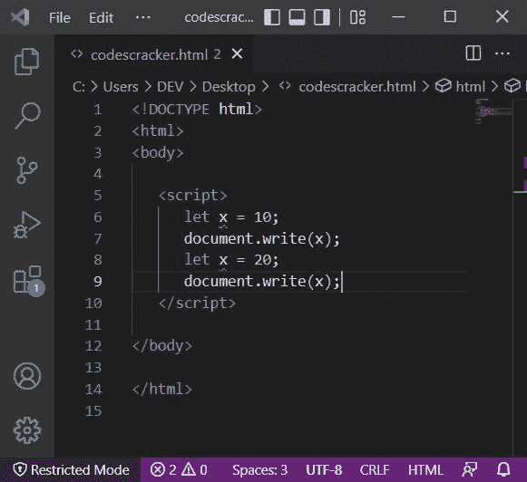
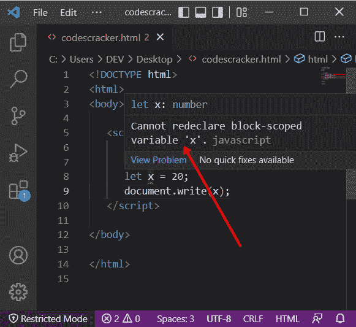
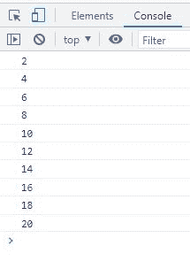

# JavaScript let 关键字| let 变量

> 原文：<https://codescracker.com/js/js-let.htm>

JavaScript **let** 关键字用于创建一个块范围的[变量](/js/js-variables.htm)。例如:

HTML with JavaScript Code

```
<!DOCTYPE html>
<html>
<body>

   <script>
      var num = 2;
      function myFun() {
         for(let i=1; i<=10; i++) {
            let res = num*i;
            console.log(res);
         }
      }
      myFun();
   </script>

</body>
</html>
```

下面给出的快照显示了上述示例产生的示例输出:



**注意-** 最佳实践是，使用[变量](/js/js-var.htm)来声明一个全局变量，而 **让**来声明一个块范围的变量。

与**变量**不同的是，<u>变量**让**变量不能被重新声明</u>。如果您这样做，那么您将得到 错误。例如:



看红色下划线指向 **x** ，用 **let** 声明的变量。如果您将鼠标悬停在两个 **x** 中的任意一个上，您将会看到:



## JavaScript 字母示例

HTML with JavaScript Code

```
<!DOCTYPE html>
<html>
<body>

   <script>
      var num = 2;
      for(let i=1; i<=10; i++)
         console.log(num*i);
   </script>

</body>
</html>
```

输出应该是:



[JavaScript 在线测试](/exam/showtest.php?subid=6)

* * *

* * *