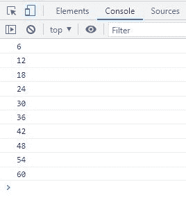
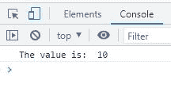

# JavaScript do...while 循环

> 原文：<https://codescracker.com/js/js-do-while-loop.htm>

**做什么...而 JavaScript 中的**循环，用于执行某个代码块一次，不管循环的 给定条件，然后继续执行同一个代码块，直到该条件将 评估为*假*。例如:

HTML with JavaScript Code

```
<!DOCTYPE html>
<html>
<body>

   <script>
      let num = 6, i = 1;
      do {
         console.log(num*i);
         i++;
      } while(i<=10);
   </script>

</body>
</html>
```

下面给出的快照显示了上面的 JavaScript 示例产生的示例输出:



## JavaScript do...while 循环语法

**do 的语法...而 JavaScript 中的**循环是:

```
do {
   // body of the loop
} while(condition);
```

自况在**做什么...而**循环，总是在*循环体*之后给出。因此，不管给定的条件如何，循环的 体总是会被立即执行。例如:

HTML with JavaScript Code

```
<!DOCTYPE html>
<html>
<body>

   <script>
      var x = 10;
      do {
         console.log("The value is: ", x);
         x++;
      } while(x>20);
   </script>

</body>
</html>
```

上述示例产生的输出是:



在上面的例子中，条件 **x > 20** 或**11>20**(**x**的值将是 11，在 使用语句 **x++增加 **x** 的值之后；**在循环体中可用)首先将 评估为**假**。然后，循环体也立即或第一次被执行。

[JavaScript 在线测试](/exam/showtest.php?subid=6)

* * *

* * *