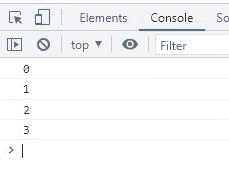

# JavaScript 中的 break 语句

> 原文：<https://codescracker.com/js/js-break-statement.htm>

JavaScript 中的 **break** 语句或关键字用于跳出当前循环。例如:

HTML with JavaScript Code

```
<!DOCTYPE html>
<html>
<body>

   <script>
      for(let i=0; i<=10; i++)
      {
         if(i==4)
            break;
         console.log(i);
      }
   </script>

</body>
</html>
```

上面的 JavaScript 示例在 break 语句上生成的输出是:



从上面的例子可以看出，如果 **i** 的值变为 4，那么 **break** 语句 将被执行，以从当前循环中中断或者停止当前循环的执行。

## JavaScript 中断语法

JavaScript 中的 **break** 语句的语法是:

```
break;
```

**注意-**JavaScript 中的[break vs . continue](/js/js-break-continue.htm)在 单独的教程中有描述。

[JavaScript 在线测试](/exam/showtest.php?subid=6)

* * *

* * *