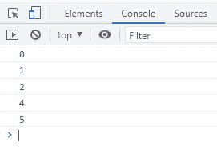
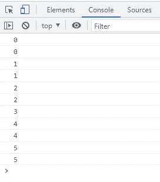

# JavaScript 中的`continue`语句

> 原文：<https://codescracker.com/js/js-continue-statement.htm>

JavaScript **continue** 语句或关键字用于跳过当前循环的 当前迭代语句的执行。例如:

HTML with JavaScript Code

```
<!DOCTYPE html>
<html>
<body>

   <script>
      for(let i=0; i<=5; i++)
      {
         if(i==3)
            continue;
         console.log(i);
      }
   </script>

</body>
</html>
```

下面给出的快照显示了上面的 JavaScript 示例 on`continue`语句产生的示例输出:



从上面的例子可以看出，当 **i** 的值变为 3 时，那么 **continue** 语句 被执行，以跳过当前迭代语句的剩余执行。

## JavaScript 继续语法

JavaScript 中 **continue** 语句的语法是:

```
continue;
```

**注意-**JavaScript 中的[break vs . continue](/js/js-break-continue.htm)在 单独的教程中有描述。

**注意-** 对于当前循环的当前 迭代，只有**继续**语句之后的语句会被跳过。例如:

HTML with JavaScript Code

```
<!DOCTYPE html>
<html>
<body>

   <script>
      for(let i=0; i<=5; i++)
      {
         console.log(i);
         if(i==3)
            continue;
         console.log(i);
      }
   </script>

</body>
</html>
```

此示例的示例输出显示在以下快照中:



在上面的例子中，当 **i** 的值变为 3 时，上面的两条语句被执行，而 下面的两条语句(在**继续**语句之后的两条语句)被跳过。

[JavaScript 在线测试](/exam/showtest.php?subid=6)

* * *

* * *