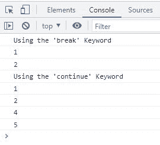

# JavaScript 中中断和继续的区别

> 原文：<https://codescracker.com/js/js-break-continue.htm>

本文旨在区分 JavaScript 的两个重要关键词，即:

*   [突破](/js/js-break-statement.htm)
*   [继续](/js/js-continue-statement.htm)

## JavaScript 中的中断与继续

下表区分了 JavaScript 中的 **break** 和 **continue** 语句/关键字:

| 破裂 | 继续 |
| 跳出当前循环 | 跳转到当前循环的下一次迭代 |
| 跳过当前循环的剩余执行 | 对于当前迭代，跳过当前循环内剩余语句的执行 |
| 停止当前循环的执行 | 停止执行当前循环中当前迭代的剩余语句 |
| 如果条件总是评估为真，则有用 | 如果希望在任何特定的迭代中跳过循环内语句的执行，这很有用 |

## JavaScript 中的中断与继续示例

```
<!DOCTYPE html>
<html>
<body>

   <script>
      const nums = [1, 2, 3, 4, 5];

      console.log("Using the 'break' Keyword");
      for(let i in nums)
      {
         if(nums[i]==3)
            break;
         console.log(nums[i]);
      }

      console.log("Using the 'continue' Keyword");
      for(let i in nums)
      {
         if(nums[i]==3)
            continue;
         console.log(nums[i]);
      }
   </script>

</body>
</html>
```

下面给出的快照显示了上面的 JavaScript 示例在 break 与 continue 语句上产生的示例输出:



[JavaScript 在线测试](/exam/showtest.php?subid=6)

* * *

* * *