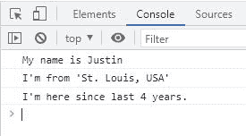

# JavaScript 函数(带示例)

> 原文：<https://codescracker.com/js/js-functions.htm>

发布这篇文章是为了提供关于 JavaScript 函数的所有信息，比如:

*   [JavaScript 中的函数是什么？](#a)
*   [如何在 JavaScript 中创建和定义函数？](#b)
*   [如何在 JavaScript 中执行一个函数？](#c)
*   [JavaScript 函数返回值](#d)
*   为什么我们在 JavaScript 中需要一个函数？
*   [JavaScript 函数示例](#f)
*   [带 1 个参数的 JavaScript 函数示例](#g)
*   [带 2 个参数的 JavaScript 函数示例](#h)
*   [带 3 个参数的 JavaScript 函数示例](#i)

## JavaScript 中的函数是什么？

JavaScript 中的函数是一段代码，用于执行定义的任务。例如:

```
function printHello()
{
   console.log("Hello");
}
```

上面名为 **printHello()** 的函数在控制台输出上打印出 **Hello** ，当它将被调用或调用[时。](#c)

## 如何在 JavaScript 中创建和定义一个函数？

要在 JavaScript 中创建和定义函数，请遵循以下语法:

```
function functionName(para1, para2, para3, ..., paraN)
{
   // block of code
   // to define the work of function
}
```

其中:

*   **函数**是用来定义函数的关键字
*   **functionName** 是函数的名称。在命名一个函数时，你需要遵循一些规则。参考 [规则命名变量](/js/js-variables.htm#a)以了解关于变量或函数名的命名
*   **para1** 、 **para2** 、 **para3** 、 **paraN** 为参数列表。参数列表是可选的。

例如:

```
function message()
{
   document.getElementById("paraOne").innerHTML = "Hey, JavaScript is fun!";
   document.getElementById("paraTwo").innerHTML = "Is not it?";
}
```

## 如何在 JavaScript 中执行一个函数？

要执行一个函数，我们需要调用它。例如:

```
message();
```

调用名为 **message()** 的函数。例如:

HTML with JavaScript Code

```
<!DOCTYPE html>
<html>
<body>

   <p id="paraOne"></p>
   <p id="paraTwo"></p>

   <script>
      function message()
      {
         document.getElementById("paraOne").innerHTML = "Hey, JavaScript is fun!";
         document.getElementById("paraTwo").innerHTML = "Is not it?";
      }

      message();
   </script>

</body>
</html>
```

Output

## JavaScript 函数返回值

**return** stament 或关键字用于在执行函数后从函数中返回值。例如:

```
function cube(num)
{
   return num*num*num;
}
```

返回数量为的**的立方体。因此，无论我们将什么值传递给名为 **cube()** 的函数，它的立方体都将被返回。例如:**

HTML with JavaScript Code

```
<!DOCTYPE html>
<html>
<body>

   <p>Cube of 5 = <span id="res"></span></p>

   <script>
      function cube(num)
      {
         return num*num*num;
      }

      document.getElementById("res").innerHTML = cube(5);
   </script>

</body>
</html>
```

Output

5 的立方=

从 **cube(5)** 初始化或复制到 **num** 的值**5**(**cube()**函数的参数)，使用 **return** 语句或关键字，将返回 **num*num*num** 的值，将为 **5*5*5** 或 **125** 。因此下面的语句 来自上面(先前)的例子:

```
document.getElementById("res").innerHTML = cube(5);
```

会变成:

```
document.getElementById("res").innerHTML = 125;
```

无论 **return** 语句出现在函数中的什么地方，函数的执行都会被终止。例如:

HTML with JavaScript Code

```
<!DOCTYPE html>
<html>
<body>

   <p id="paraOne"></p>
   <p id="paraTwo"></p>

   <script>
      function message()
      {
         document.getElementById("paraOne").innerHTML = "Hey, JavaScript is fun!";
         return;
         document.getElementById("paraTwo").innerHTML = "Is not it?";
      }

      message();
   </script>

</body>
</html>
```

Output

也就是说，在函数中， **return** 语句之后的所有可用代码块都将被跳过执行。

## 为什么我们需要 JavaScript 中的函数？

我们需要 JavaScript 中的一个函数将一些代码块封装在一个函数中，以便多次使用。也就是说，我们需要一个函数来多次或按要求次数执行某个代码块/语句，而无需多次编写该代码块。例如:

HTML with JavaScript Code

```
<!DOCTYPE html>
<html>
<body>

   <p>Cube of 8 = <span id="resOne"></span></p>
   <p>Cube of 12 = <span id="resTwo"></span></p>
   <p>Cube of 33 = <span id="resThree"></span></p>

   <script>
      function cube(num)
      {
         return num*num*num;
      }

      document.getElementById("resOne").innerHTML = cube(8);
      document.getElementById("resTwo").innerHTML = cube(12);
      document.getElementById("resThree").innerHTML = cube(33);
   </script>
   </script>

</body>
</html>
```

Output

8 的立方=

12 的立方=

33 的立方=

计算一个数的立方的代码被创建一次，并被使用 3 次。这就是函数给我们带来好处的方式。

**请注意:**函数内部定义的变量对于定义它的函数来说是局部的。

## JavaScript 函数示例

现在我认为，是时候举一些关于 JavaScript 中的函数的例子，来澄清所有剩下的疑问了。让我从一个没有参数的函数开始。

### 不带参数的 JavaScript 函数示例

```
<!DOCTYPE html>
<html>
<body>

   <script>
      function codescracker()
      {
         console.log("My name is Justin");
         console.log("I'm from 'St. Louis, USA'");
         console.log("I'm here since last 4 years.");
      }
      codescracker();
   </script>

</body>
</html>
```

下面给出的快照显示了上面的 JavaScript 函数示例产生的示例输出:



### 带 1 个参数的 JavaScript 函数示例

HTML with JavaScript Code

```
<!DOCTYPE html>
<html>
<body>

   <p>∛64 = <span id="res"></span></p>

   <script>
      function codescracker(num)
      {
         return Math.cbrt(num);
      }
      document.getElementById("res").innerHTML = codescracker(64);
   </script>

</body>
</html>
```

Output

∛64 =

### 带有两个参数的 JavaScript 函数示例

HTML with JavaScript Code

```
<!DOCTYPE html>
<html>
<body>

   <p>Gross Salary = $68400 and Tax Deduction@22%</p>
   <p>Actual Salary after Tax Deduction  = <span id="res"></span></p>

   <script>
      function inHandSalary(totalSalary, taxPercentage)
      {
         let taxAmount = (taxPercentage*totalSalary)/100;
         return (totalSalary-taxAmount);
      }
      document.getElementById("res").innerHTML = inHandSalary(68400, 22);
   </script>

</body>
</html>
```

Output

总工资= 68400 美元，扣除 22%的税款

税后实际工资=

### 带有 3 个参数的 JavaScript 函数示例

HTML with JavaScript Code

```
<!DOCTYPE html>
<html>
<body>

   <p>Principle Amount = $60000, Rate of Interest = 7.8%, Time = 4 Years</p>
   <p>Simple Interest based on above values  = <span id="res"></span></p>

   <script>
      function si(p, r, t)
      {
         return ((p*r*t)/100);
      }
      document.getElementById("res").innerHTML = si(60000, 7.8, 4);
   </script>

</body>
</html>
```

Output

本金= 60000 美元，利率= 7.8%，时间= 4 年

基于上述值的单利=

同样，您可以根据 JavaScript 函数的需要使用任意数量的参数。这取决于您和您的应用程序的要求。

[JavaScript 在线测试](/exam/showtest.php?subid=6)

* * *

* * *